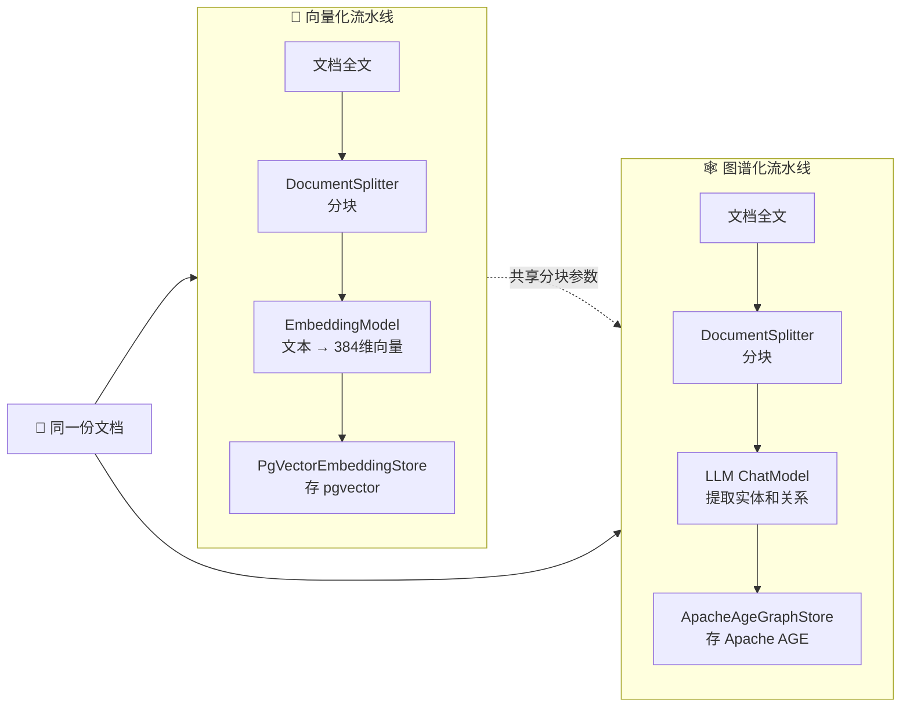
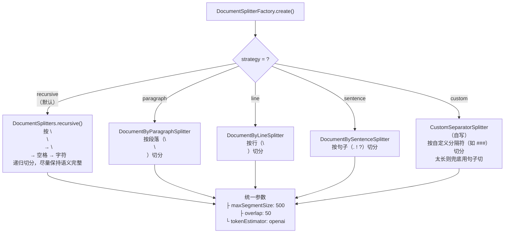
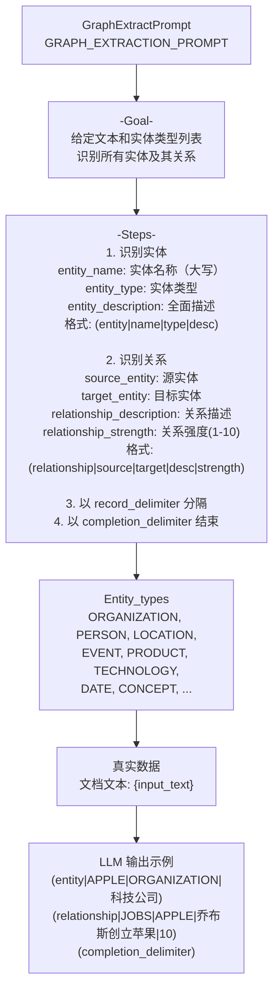
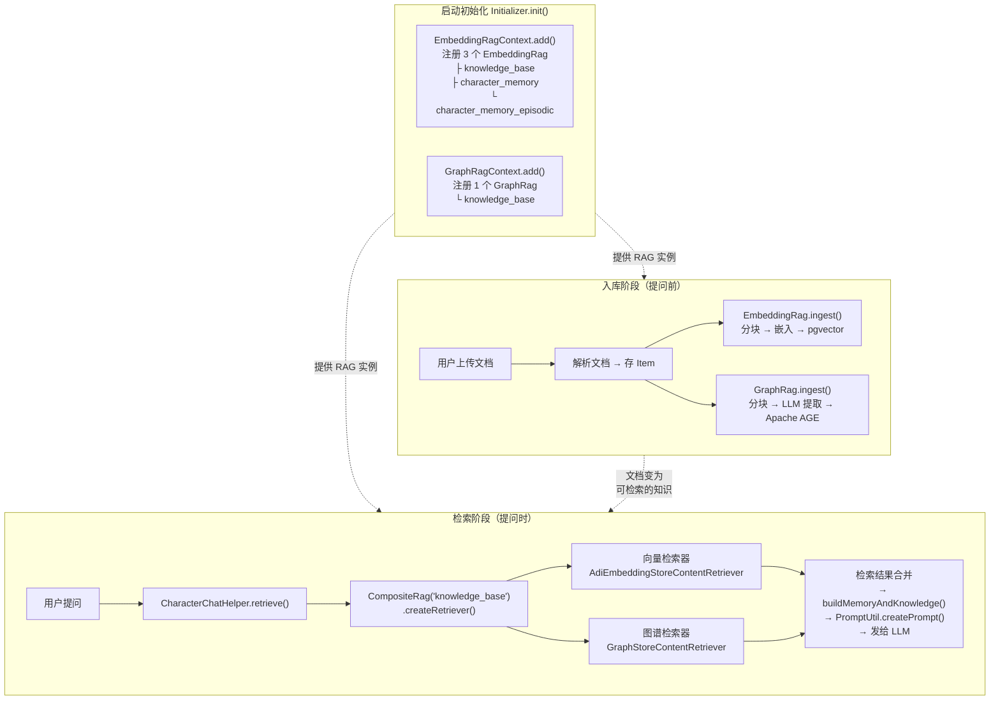

# RAG 知识库入库完整流程

> 本文档描述从用户上传文档到完成向量化索引 + 图谱化索引的完整流程，包含文档解析、分块策略、向量嵌入、实体关系提取等全部环节。

---

## 一、入库流程全景图

```mermaid
flowchart TD
    USER["👤 用户上传文档\nPDF / Word / HTML / TXT"] --> CTRL["📨 KnowledgeBaseController.uploadDocs()\nPOST /kb/uploadDocs/{kb_uuid}"]

    CTRL --> PARAMS["📋 请求参数\n├ MultipartFile[] docs（文档文件）\n├ Boolean embedding（是否上传后索引）\n└ List indexTypes（索引类型：embedding / graphical）"]

    PARAMS --> LOOP{"遍历每个\n上传的文件"}

    LOOP --> SAVE["💾 ① 保存原始文件到磁盘\nFileOperatorContext.saveFile()\n返回 ZhiMeshFile 记录"]

    SAVE --> PARSE["📄 ② 解析文档内容\nFileOperatorContext.loadDocument()\nlangchain4j 文档解析器\n├ PDF  → Apache PDFBox\n├ Word → Apache POI\n├ HTML → Jsoup\n└ TXT  → 直接读取"]

    PARSE --> PARSE_OK{"解析\n成功？"}
    PARSE_OK -->|"❌ 失败\n不支持的文件格式"| SKIP["跳过该文件\n记录警告日志"]
    PARSE_OK -->|"✅ 成功\n得到纯文本"| CONTENT["得到纯文本 content\n替换 \\u0000 字符\n（PostgreSQL 不支持）"]

    CONTENT --> CREATE_ITEM["📝 ③ 创建 KnowledgeBaseItem\nadi_knowledge_base_item 表\n├ uuid: 自动生成\n├ kb_id / kb_uuid: 所属知识库\n├ source_file_id: 原始文件 ID\n├ title: 原始文件名\n├ brief: 前 200 字摘要\n├ remark: 文档全文\n├ embedding_status: 初始\n└ graphical_status: 初始"]

    CREATE_ITEM --> INDEX_CHECK{"indexAfterUpload\n= true？"}
    INDEX_CHECK -->|"否"| DONE_NO_INDEX["✅ 完成\n文档已保存，等待手动索引"]
    INDEX_CHECK -->|"是"| INDEX_FLOW["④ 进入索引流程\nKnowledgeBaseService.indexItems()"]

    INDEX_FLOW --> INDEX_CHECK_REDIS["🔒 检查是否已有索引任务\nRedis HASKEY user:indexing:{userId}\n防止重复索引"]

    INDEX_CHECK_REDIS --> INDEX_OK{"是否有\n进行中的\n索引任务？"}
    INDEX_OK -->|"是"| INDEX_REJECT["❌ 拒绝\n抛出 A_DOC_INDEX_DOING\n提示「文档正在索引中」"]
    INDEX_OK -->|"否"| INDEX_START["🔒 Redis INCR user:indexing:{userId}\n标记为「索引中」\nTTL = 10 分钟"]

    INDEX_START --> INDEX_ITEM["KnowledgeBaseItemService\n.checkAndIndexing()\n→ 遍历每个 Item\n→ asyncIndex()"]

    INDEX_ITEM --> ASYNC["⑤ asyncIndex()\n异步索引单个文档\n参数：user + knowledgeBase + kbItem"]

    ASYNC --> BOTH{"indexTypes\n包含哪些？"}

    BOTH --> EMB["📐 ⑥ 向量化流水线\nindexingEmbedding()"]
    BOTH --> GRAPH["🕸️ ⑩ 图谱化流水线\nindexingGraph()"]

    EMB --> EMB_STATUS["设置状态\nembedding_status = DOING\nembedding_status_change_time = now"]
    EMB_STATUS --> EMB_CLEAN["清除旧向量数据\niKnowledgeEmbeddingService\n.deleteByItemUuid(itemUuid)"]
    EMB_CLEAN --> EMB_INGEST["⑦ EmbeddingRag.ingest()\n从注册中心取出\nEmbeddingRagContext.get('knowledge_base')"]

    EMB_INGEST --> EMB_SPLIT["⑧ 文档分块\nDocumentSplitterFactory.create()\n策略：知识库配置"]

    EMB_SPLIT --> SPLIT_DETAIL["分块参数\n├ strategy: recursive / paragraph / line / sentence / custom\n├ maxSegmentSize: 每段最大 token 数（如 500）\n├ overlap: 段间重叠 token 数（如 50）\n├ customSeparator: 自定义分隔符（如 ###）\n└ tokenEstimator: OpenAI / HuggingFace / Qwen"]

    SPLIT_DETAIL --> EMB_EMBED["⑨ 文本 → 向量\nEmbeddingModel.embed()\nbge-small-zh-v1.5（384 维）\n或 OpenAI / DashScope 远程 API"]

    EMB_EMBED --> EMB_STORE["💾 存入 pgvector\nPgVectorEmbeddingStore\n表：adi_knowledge_base_embedding_xxx\n（后缀由嵌入模型维度决定）\n├ 384 维 → _bge_384\n├ 1024 维 → _qwen_1024\n└ 1536 维 → _openai_1536"]

    EMB_STORE --> EMB_DONE["✅ 向量化完成\n设置 embedding_status = DONE"]

    EMB_DONE --> EMB_FAIL{"向量化\n成功？"}
    EMB_FAIL -->|"❌"| EMB_MARK_FAIL["标记 embedding_status = FAIL\n记录异常日志"]

    GRAPH --> GRAPH_STATUS["设置状态\ngraphical_status = DOING\ngraphical_status_change_time = now"]
    GRAPH_STATUS --> GRAPH_LLM["选定图谱提取 LLM\nLLMContext.getServiceById()\n优先用知识库配置的 ingestModelId\n没有则自动选第一个可用模型"]

    GRAPH_LLM --> GRAPH_INGEST["⑪ GraphRag.ingest()\n从注册中心取出\nGraphRagContext.get('knowledge_base')"]

    GRAPH_INGEST --> GRAPH_SPLIT["⑫ 文档分块\nDocumentSplitterFactory.create()\n与向量化使用相同的分块参数"]

    GRAPH_SPLIT --> GRAPH_LOOP["⑬ 遍历每个分块"]

    GRAPH_LOOP --> GRAPH_SAVE_SEG["保存分块文本\nadi_knowledge_base_graph_segment 表\n├ uuid: 自动生成\n├ kb_uuid / kb_item_uuid\n├ remark: 分块原始文本\n└ user_id"]

    GRAPH_SAVE_SEG --> GRAPH_QUOTA["检查用户配额\nQuotaHelper.checkTextQuota()\n防止图谱提取消耗超限"]

    GRAPH_QUOTA --> GRAPH_QUOTA_OK{"配额\n充足？"}
    GRAPH_QUOTA_OK -->|"否"| GRAPH_SKIP["跳过此块\n记录警告日志"]
    GRAPH_QUOTA_OK -->|"是"| GRAPH_EXTRACT["⑭ LLM 提取实体和关系\nChatModel.chat()\nPrompt: GraphExtractPrompt\nGRAPH_EXTRACTION_PROMPT"]

    GRAPH_EXTRACT --> GRAPH_PROMPT["提取 Prompt 结构\n-Goal-\n给定文本，识别实体和关系\n\n-Steps-\n1. 识别实体：entity_name, entity_type, entity_description\n   格式：(entity|name|type|desc)\n2. 识别关系：source_entity, target_entity, relationship_description, strength\n   格式：(relationship|source|target|desc|strength)\n3. 以指定分隔符输出列表\n\nEntity_types: ORGANIZATION,PERSON,LOCATION,EVENT,..."]

    GRAPH_PROMPT --> GRAPH_PARSE["⑮ 解析 LLM 返回结果\nLLM 返回结构化实体+关系\n示例：\n(entity|APPLE|ORGANIZATION|科技公司)\n(relationship|JOBS|APPLE|乔布斯创立|10)"]

    GRAPH_PARSE --> GRAPH_COST["扣 Token 配额\nUserDayCostService\n.appendCostToUser()\n记录本次 LLM 调用的 Token 消耗"]

    GRAPH_COST --> GRAPH_STORE["💾 存入 Apache AGE\nApacheAgeGraphStore\n图：adi_knowledge_base_graph\n├ 实体 → 图节点 (Vertex)\n├ 关系 → 图边 (Edge)\n├ 按 kb_uuid 标识列过滤\n└ 附加 kb_item_uuid 列"]

    GRAPH_STORE --> GRAPH_LOOP_NEXT{"还有更多\n分块？"}
    GRAPH_LOOP_NEXT -->|"是"| GRAPH_LOOP
    GRAPH_LOOP_NEXT -->|"否"| GRAPH_DONE["✅ 图谱化完成\n设置 graphical_status = DONE"]

    GRAPH_DONE --> GRAPH_FAIL{"图谱化\n成功？"}
    GRAPH_FAIL -->|"❌"| GRAPH_MARK_FAIL["标记 graphical_status = FAIL\n记录异常日志"]

    EMB_MARK_FAIL --> CLEANUP
    GRAPH_MARK_FAIL --> CLEANUP
    EMB_DONE --> CLEANUP["⑯ 最终清理"]
    GRAPH_DONE --> CLEANUP

    CLEANUP --> SIGNAL["📢 发送统计重算信号\nRedis SADD kb:statistic:recalculate:signal\n→ 触发知识库统计信息更新\n（embedding_count、item_count）"]

    SIGNAL --> DEC["🔒 Redis DECR user:indexing:{userId}\n释放索引锁"]

    DEC --> DEC_CHECK{"剩余索引\n计数 ≤ 0？"}
    DEC_CHECK -->|"是"| DEL["Redis DEL user:indexing:{userId}\n清除索引标记"]
    DEC_CHECK -->|"否"| FINISH

    DEL --> FINISH["🏁 入库完成\n知识库可被检索"]

    LOOP --> DONE_NO_INDEX
    INDEX_REJECT --> FINISH_REJECT["🏁 拒绝入库"]
    SKIP --> FINISH_SKIP["🏁 跳过该文件"]
```

---

## 二、两条流水线对比

| 维度 | 向量化流水线 | 图谱化流水线 |
|------|-------------|-------------|
| **分块** | DocumentSplitterFactory 创建 | DocumentSplitterFactory 创建（相同参数） |
| **处理** | EmbeddingModel.embed() 本地/远程 | LLM ChatModel.chat() 提取实体 |
| **存储** | pgvector → adi_knowledge_base_embedding | Apache AGE → adi_knowledge_base_graph |
| **分块文本** | 不单独存 | 存到 adi_knowledge_base_graph_segment |
| **耗时** | 快（本地模型秒级） | 慢（需要 LLM 逐个分块调用） |
| **消耗** | 低（嵌入不消耗用户配额） | 高（每次 LLM 调用都扣配额） |
| **状态字段** | embedding_status | graphical_status |

---

## 三、分块策略路由

---

## 四、图谱提取 Prompt 结构

---

## 五、涉及的数据库表

| 表 | 阶段 | 存储内容 |
|----|------|---------|
| `adi_file` | ① | 原始文件记录 |
| `adi_knowledge_base` | — | 知识库配置（分块策略、检索参数） |
| `adi_knowledge_base_item` | ③ | 文档全文、向量化状态、图谱化状态 |
| `adi_knowledge_base_embedding_xxx` | ⑨ | 向量分块（pgvector） |
| `adi_knowledge_base_graph` | ⑮ | 知识图谱节点+边（Apache AGE） |
| `adi_knowledge_base_graph_segment` | ⑬ | 图谱分块原始文本（PostgreSQL） |
| `adi_user_day_cost` | ⑭ | 图谱提取的 Token 消耗 |
| `adi_llm_call_record` | ⑭ | 图谱提取的 LLM 调用审计 |

---

## 六、关键文件索引

| 步骤 | 文件 | 方法 / 类 |
|------|------|----------|
| ①② | `zhimesh-chat/.../controller/KnowledgeBaseController.java` | `uploadDocs()` |
| ① | `zhimesh-common/.../service/FileService.java` | `saveFile()` |
| ② | `zhimesh-common/.../file/FileOperatorContext.java` | `loadDocument()` |
| ③ | `zhimesh-common/.../service/KnowledgeBaseService.java` | `uploadDoc()` |
| ④ | `zhimesh-common/.../service/KnowledgeBaseService.java` | `indexItems()` |
| ⑤ | `zhimesh-common/.../service/KnowledgeBaseItemService.java` | `asyncIndex()` |
| ⑥⑦⑧⑨ | `zhimesh-common/.../service/KnowledgeBaseItemService.java` | `indexingEmbedding()` |
| ⑦ | `zhimesh-common/.../rag/EmbeddingRag.java` | `ingest()` |
| ⑧ | `zhimesh-common/.../rag/DocumentSplitterFactory.java` | `create()` |
| ⑨ | `zhimesh-common/.../config/embeddingstore/PgVectorEmbeddingStoreConfig.java` | `kbEmbeddingStore` Bean |
| ⑩⑪⑫⑬⑭⑮ | `zhimesh-common/.../service/KnowledgeBaseItemService.java` | `indexingGraph()` |
| ⑪ | `zhimesh-common/.../rag/GraphRag.java` | `ingest()` |
| ⑭ | `zhimesh-common/.../rag/GraphExtractPrompt.java` | `GRAPH_EXTRACTION_PROMPT` |
| ⑮ | `zhimesh-common/.../config/graphstore/ApacheAgeGraphStoreConfig.java` | `kbGraphStore` Bean |
| ⑯ | `zhimesh-common/.../service/KnowledgeBaseItemService.java` | `asyncIndex()` finally 块 |

---

## 七、RAG 系统架构总览

