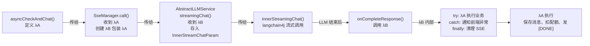
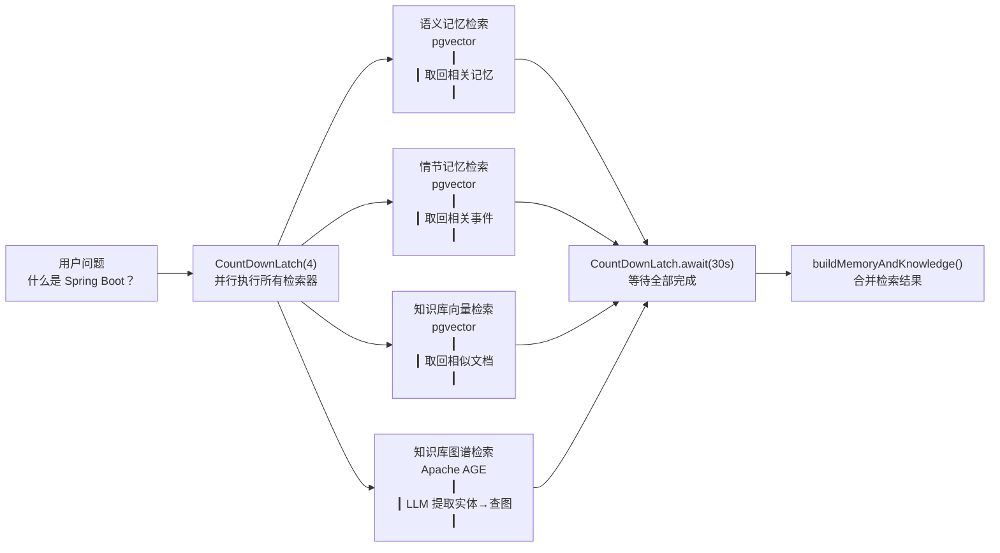

# ZhiMesh 一次聊天请求完整流程

> 本文档描述从用户输入问题到 AI 流式返回答案的完整调用链路，包含 SSE 连接管理、RAG 检索、LLM 调用、Token 审计等全部环节。

---

## 一、流程全景图

```mermaid
flowchart TD
    USER["👤 用户输入问题\n点击发送"] --> CTRL["📨 ChatController.ask()\nPOST /chat/process"]

    CTRL --> CHECK["🔒 SseManager.checkOrComplete()\nRedis 速率检查 + 并发检查"]

    CHECK --> PASS{"检查是否\n通过？"}
    PASS -->|"❌ 超限"| REJECT["拒绝请求\n向前端发送 [ERROR] 事件"]
    PASS -->|"✅ 通过"| SSE["📡 SseManager.startSse()"]

    SSE --> SSE1["创建 SseEmitter（180秒超时）"]
    SSE1 --> SSE2["存入 SseManager.entries Map\nkey = sseUuid"]
    SSE2 --> SSE3["发 event:[START] 事件给前端"]
    SSE3 --> SSE4["Redis INCR 速率计数器 +1"]
    SSE4 --> SSE5["return sseEmitter 给前端\n主线程下班"]

    SSE5 --> ASYNC["⚙️ @Async asyncCheckAndChat()\n异步线程开始工作"]

    ASYNC --> STEP1["🎭 ① 加载角色 Character\nadi_character 表\n→ ai_system_message\n→ kb_ids（关联的知识库）\n→ mcp_ids（关联的 MCP 工具）\n→ llm_temperature\n→ audio_config"]

    STEP1 --> STEP2["🧠 ② 选取 LLM 模型\nLLMContext.getServiceOrDefault()\n优先用用户指定的\n否则自动选第一个免费可用模型"]

    STEP2 --> STEP3["📢 ③ 发状态事件给前端\nSseManager.sendPartial()\nevent:[STATE_CHANGED]\nstate: question_analysing\n→ 前端显示「正在分析问题」"]

    STEP3 --> STEP4["📢 ④ 发状态事件给前端\nSseManager.sendPartial()\nevent:[STATE_CHANGED]\nstate: knowledge_searching\n→ 前端显示「正在搜索知识库」"]

    STEP4 --> RAG["🔍 ⑤ RAG 检索（并行执行）\nCharacterChatHelper.retrieve()\nCountDownLatch 等待全部完成"]

    RAG --> RAG1["📐 语义记忆检索\nEmbeddingRag\npgvector 表\nadi_character_memory_embedding\nFilter: character_id + 非情节记忆\nTop-3 + minScore 0.6"]
    RAG --> RAG2["📐 情节记忆检索\nEmbeddingRag\npgvector 表\nadi_episodic_memory_embedding\nFilter: character_id\nTop-3 + minScore 0.6"]
    RAG --> RAG3["📐 知识库向量检索\nEmbeddingRag\npgvector 表\nadi_knowledge_base_embedding\nFilter: kb_uuid IN (...)\nTop-3 + minScore 0.6"]
    RAG --> RAG4["🕸️ 知识库图谱检索\nGraphRag\nApache AGE 图\nadi_knowledge_base_graph\nLLM 先提取实体 → 再查图\n实体+关系子图"]

    RAG1 --> PROMPT["📝 ⑥ 拼装 Prompt\nbuildMemoryAndKnowledge()\n检索结果 → 记忆字符串 + 知识字符串"]
    RAG2 --> PROMPT
    RAG3 --> PROMPT
    RAG4 --> PROMPT

    PROMPT --> PROMPT2["📝 ⑦ PromptUtil.createPrompt()\n用户问题 + 记忆 + 知识 + 音频提示\n→ 套入 PROMPT_INFO_EXTRA_TEMPLATE 模板\n→ processedPrompt"]

    PROMPT2 --> BUILD["🏗️ ⑧ buildChatRequestParams()\n组装最终 ChatModelRequest\n├ systemMessage: 角色系统提示词\n├ memoryId: MapDB 短期记忆 ID\n├ userMessage: processedPrompt\n├ imageUrls: 多模态图片\n├ mcpClients: MCP 工具列表\n├ returnThinking: 是否返回思考过程\n└ enableWebSearch: 是否启用网络搜索"]

    BUILD --> PACK["📦 ⑨ 打包 SseAskParam\nuser + questionUuid + sseUuid\n+ modelName + httpRequestParams\n+ modelProperties"]

    PACK --> CALL["🎬 ⑩ SseManager.call(param, λA)\n注册 SSE 生命周期回调\n→ streamingChat(param, λB)"]

    CALL --> LLM["🤖 ⑪ AbstractLLMService\nstreamingChat() → innerStreamingChat()\n创建 StreamingChatModel\n调用 langchain4j 流式 API"]

    LLM --> STREAM["🌊 ⑫ LLM 流式输出中..."]

    STREAM --> ONTOKEN["onPartialResponse()\n每生成一个 token\n→ SseManager.parseAndSendPartialMsg()\n→ SseEmitter.send(msg)\n→ 前端逐字显示（打字机效果）"]

    ONTOKEN -->|"循环直到结束"| ONTOKEN

    STREAM --> ONTHINK["onPartialThinking()\n推理模型思考过程\n→ SseManager.sendThinking()\nevent:[THINKING]\n→ 前端显示思考内容"]

    STREAM --> ONTOOL{"有 MCP\n工具调用？"}

    ONTOOL -->|"是"| TOOL["🔧 执行 MCP 工具\n→ SseManager.sendToolCall()\nevent:[TOOL_CALL]\n将工具结果拼回消息列表\n→ 递归调用 innerStreamingChat()\n最多递归 5 层"]
    TOOL --> LLM

    ONTOOL -->|"否"| COMPLETE["✅ onCompleteResponse()\nLLM 输出结束\n→ 触发 λB → 触发 λA"]

    COMPLETE --> SAVE["💾 ⑬ 保存消息到 DB\nadi_character_message\n用户消息 + AI 回复"]
    COMPLETE --> REF["💾 ⑭ 创建消息引用\nadi_character_message_ref_embedding\nadi_character_message_ref_graph\nadi_character_message_ref_memory_embedding"]
    COMPLETE --> MEMORY["💾 ⑮ 异步提取长期记忆\nLongTermMemoryService.asyncAdd()\nLLM 从本轮对话中提取\n→ 语义记忆 + 情节记忆\nadi_character_memory_embedding\nadi_episodic_memory_embedding"]
    COMPLETE --> QUOTA["💾 ⑯ 扣 Token 配额\nUserDayCostService.appendCostToUser()\nadi_user_day_cost 表"]
    COMPLETE --> AUDIT["💾 ⑰ LLM 调用审计\nLLMCallRecordService\nadi_llm_call_record 表\n记录：模型、Token 数、耗时"]

    SAVE --> CLEANUP["🧹 ⑱ SseManager.sendComplete()"]
    REF --> CLEANUP
    MEMORY --> CLEANUP
    QUOTA --> CLEANUP
    AUDIT --> CLEANUP

    CLEANUP --> CLOSE1["发送 event:[DONE] 给前端"]
    CLOSE1 --> CLOSE2["SseEmitter.complete() 关闭连接"]
    CLOSE2 --> CLOSE3["SseManager.entries.remove(sseUuid)"]
    CLOSE3 --> CLOSE4["Redis SREM user:active-sse:用户ID"]
    CLOSE4 --> DONE["🏁 连接关闭\n一次对话完成"]
```

---

## 二、涉及的存储系统

| 存储 | 使用步骤 | 用途 |
|------|---------|------|
| **Redis** | ③ ⑥⑱ | 速率限流、并发控制、SSE 清理 |
| **PostgreSQL** | ① ⑬⑯⑰ | 角色配置、消息记录、配额、审计 |
| **pgvector** | ⑤ | 知识库向量检索、语义记忆检索、情节记忆检索 |
| **Apache AGE** | ⑤ | 知识图谱实体关系检索 |
| **MapDB** | ⑧ | 短期对话记忆（最近 N 条消息） |
| **外部 LLM API** | ⑫ | OpenAI / DashScope / Ollama 等 |

---

## 三、关键文件索引

| 步骤 | 文件 | 方法 / 类 |
|------|------|----------|
| ① | `zhimesh-chat/.../controller/ChatController.java` | `ask()` |
| ②③④⑤⑥ | `zhimesh-common/.../helper/SseManager.java` | `checkOrComplete()`, `startSse()` |
| ③④ | `zhimesh-common/.../helper/RateLimitHelper.java` | `checkRequestTimes()`, `increaseRequestTimes()` |
| ⑤ | `zhimesh-common/.../service/CharacterChatService.java` | `sseAsk()`, `asyncCheckAndChat()` |
| ⑤⑪ | `zhimesh-common/.../util/CharacterChatHelper.java` | `retrieve()`, `buildMemoryAndKnowledge()`, `buildChatRequestParams()` |
| ⑤ | `zhimesh-common/.../rag/CompositeRag.java` | `createRetriever()` |
| ⑤ | `zhimesh-common/.../rag/ZhiMeshEmbeddingStoreContentRetriever.java` | `retrieve()` 向量检索 |
| ⑤ | `zhimesh-common/.../rag/GraphStoreContentRetriever.java` | `retrieve()` 图谱检索 |
| ⑤ | `zhimesh-common/.../util/PromptUtil.java` | `createPrompt()` |
| ⑨⑩ | `zhimesh-common/.../helper/SseManager.java` | `call()`, `registerEventStreamListener()` |
| ⑩⑪⑫ | `zhimesh-common/.../languagemodel/AbstractLLMService.java` | `streamingChat()`, `innerStreamingChat()` |
| ⑬⑭ | `zhimesh-common/.../service/CharacterMessageService.java` | 消息保存、引用创建 |
| ⑮ | `zhimesh-common/.../memory/longterm/LongTermMemoryService.java` | `asyncAdd()` |
| ⑯ | `zhimesh-common/.../service/UserDayCostService.java` | `appendCostToUser()` |
| ⑰ | `zhimesh-common/.../service/LLMCallRecordService.java` | 审计记录保存 |

---

## 四、SSE 事件类型一览

| 事件名 | 触发时机 | 前端效果 |
|--------|---------|---------|
| `[START]` | SSE 连接建立 | 显示聊天容器 |
| `[STATE_CHANGED]` | 分析问题 / 搜索知识库 | 显示状态提示文字 |
| `[THINKING]` | 推理模型思考过程 | 可折叠的思考区域 |
| `[TOOL_CALL]` | LLM 调用 MCP 工具 | 显示工具调用状态 |
| `[AUDIO]` | TTS 语音合成 | 播放音频 |
| `[SOURCE_LINKS]` | 知识库引用来源 | 显示参考文档链接 |
| `(无事件名)` | AI 逐字生成文本 | 打字机效果追加文字 |
| `[DONE]` | AI 回复结束 | 停止 loading，显示完成 |
| `[ERROR]` | 任何错误 | 显示错误信息 |

---

## 五、两层 Lambda 回调链

**λA**（asyncCheckAndChat 定义）：
- 保存消息到 adi_character_message
- 创建消息引用
- 提取长期记忆
- 扣 Token 配额
- LLM 调用审计
- 发送 [DONE] 事件

**λB**（SseManager.call 定义）：
- 执行 λA
- 如果出错，通知前端
- 无论如何，清理 SSE 连接

---

## 六、RAG 检索并行执行示意

