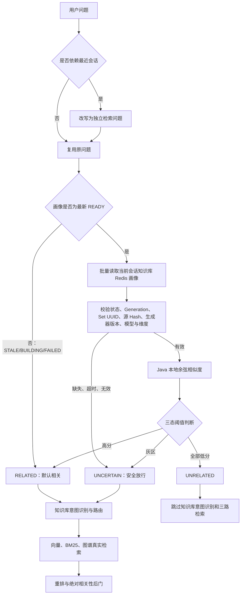
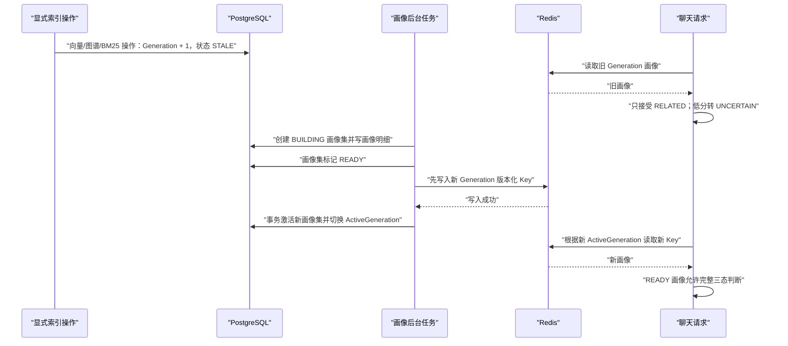

# 知识库多主题路由画像与低延迟前置门控实施方案

## 1. 背景与目标

角色聊天当前需要在知识库意图识别之前判断：用户问题是否可能与当前会话关联的任一知识库有关。如果能够高置信判定为无关，则跳过知识库意图识别、BM25 readiness 检查以及向量、BM25、图谱三路真实检索，避免无关问题污染回答并浪费检索资源。

旧方案在当前会话的全部知识分块向量上执行受限 Top-K 探测。Top-K 只限制返回数量，并不限制数据库参与距离计算的分块数量；当前 pgvector 配置还没有启用 ANN 索引。因此，大知识库可能让这一步进入聊天主链路的同步延迟。

本方案把前置门控改为：

- 每个知识库异步生成数量有界的多主题路由画像；
- PostgreSQL 保存画像真相与不可变版本；
- Redis 保存在线读取副本；
- 完整问题不改写；只有上下文依赖问题才结合最近会话生成独立检索问题；
- 请求阶段最多执行一次 Redis `MGET` 和 Java 本地余弦相似度；
- 知识库画像更新时直接跳过该画像判断并默认相关，请求不等待新画像；
- 长期记忆路由保持完全独立；
- 重排后的绝对相关性检查继续作为 Prompt 注入前的最后防线。

## 2. 目标请求链路



前置画像只决定是否跳过全部知识库路径。第一版不使用画像缩小具体知识库列表，避免把某个真实相关知识库提前排除。

## 3. 数据模型

完整 SQL 位于：

`server/db_migration/029_add_kb_route_profile.sql`

该文件不含 `psql` 专用元命令，可以直接复制到 IntelliJ IDEA Database Console 执行。新环境直接执行当前版本的 029 即可。

如果数据库已经执行过早期版本的 029，还必须继续执行：

`server/db_migration/030_fix_kb_route_profile_model_identity.sql`

030 会补充模型身份字段并修正 READY 约束。它不会清空知识库或画像数据，可重复执行。

### 3.1 知识库主表状态

在 `adi_knowledge_base` 增加：

| 字段 | 含义 |
| --- | --- |
| `route_profile_status` | `NONE/STALE/BUILDING/READY/FAILED` |
| `route_profile_generation` | 显式向量化、图谱化或 BM25 重建请求对应的最新 Generation |
| `route_profile_active_generation` | 当前仍在在线服务的画像 Generation；重建期间可以小于最新 Generation |
| `route_profile_set_uuid` | 当前仍在服务的不可变画像集 UUID；重建时不清空 |
| `route_profile_source_hash` | 最新知识源 Manifest Hash |
| `route_profile_model_id` | 当前在线画像使用的可选数据库模型 ID；配置型本地模型允许为 0 |
| `route_profile_model_identity` | 当前在线画像使用的权威模型身份字符串 |
| `route_profile_status_change_time` | 状态变更时间 |

本项目的本地 BGE 嵌入模型由配置创建，数据库中不一定存在对应的 `embedding` 模型记录。因此，在线兼容性边界使用 `route_profile_model_identity + embedding_dimension`，而不是强制依赖 `route_profile_model_id`。模型 ID 只保留作可选审计元数据。

`route_profile_generation` 与 `route_profile_active_generation` 分离，是实现“旧画像继续服务”的关键：

```text
更新前：generation=8, activeGeneration=8, status=READY
更新后：generation=9, activeGeneration=8, status=STALE
构建中：generation=9, activeGeneration=8, status=BUILDING
发布后：generation=9, activeGeneration=9, status=READY
```

### 3.2 画像集表

`adi_knowledge_base_route_profile_set` 保存一次不可变构建及发布记录，主要字段包括：

- 知识库 ID 与 UUID；
- Generation；
- Source Manifest Hash；
- 嵌入模型身份与维度；
- 画像生成器版本；
- 画像数量上限和实际数量；
- `BUILDING/READY/ACTIVE/SUPERSEDED/FAILED` 生命周期；
- 构建时间、激活时间和错误信息。

数据库约束保证同一个知识库只能有一个 `ACTIVE` 画像集。

### 3.3 画像明细表

`adi_knowledge_base_route_profile` 保存实际画像：

- `OVERVIEW`：知识库标题与简介；
- `DOCUMENT`：文档标题、摘要和章节信息；
- `TOPIC`：从候选分块中选择的代表性主题；
- 可审计的 `profile_text` 与 `source_refs`；
- 归一化后的 `real[]` Float32 向量。

使用 PostgreSQL `real[]` 而不是固定维度 `vector(512)`，使画像真相表可以兼容项目中的多种嵌入维度。该表不承担在线向量搜索，因此无需建立 HNSW 或 IVFFlat 索引。

## 4. 多主题画像生成

### 4.1 第一版不调用 LLM

第一版使用确定性算法，避免额外模型费用、生成漂移和不可重复问题。

候选来源：

1. 知识库标题与备注；
2. 知识条目标题与 `brief`；
3. 文档一级、二级标题；
4. 每个文档开头、中部、结尾的代表分块；
5. 按文档均匀分配采样名额，避免大文档垄断候选池。

候选处理：

- NFKC 标准化；
- 空白归一化；
- 内容 Hash 去重；
- 删除只有通用停用成分的候选；
- 单候选限制为默认 256 Token；
- 总候选池默认不超过 256 条；
- 批量使用当前知识库嵌入模型生成向量。

选择方法：

1. 强制保留一条 `OVERVIEW`；
2. 保留有信息量的 `DOCUMENT` 画像；
3. 使用最远点选择或 K-Medoids 思路选择差异较大的真实候选；
4. 默认每个知识库生成 16 条，允许配置为 1～32 条；
5. 保存真实代表文本，不使用没有可读文本对应的纯 K-Means 数学中心；
6. 向量写库和写 Redis 前统一执行 L2 归一化。

### 4.2 Source Manifest Hash

按稳定顺序拼接以下内容并计算 SHA-256：

- 知识库标题、备注；
- 所有有效知识条目 UUID、标题、摘要；
- 每个条目的 `active_chunk_set_uuid`；
- 条目的 Active Chunk Set UUID；该不可变 Chunk Set 记录对应的 `source_content_hash` 与分块配置 Hash；
- 嵌入模型身份；
- 画像生成器版本；
- 候选池与画像数量配置。

相同内容与配置必须生成相同 Hash；相关内容变化必须改变 Manifest Hash，但只有显式索引操作才创建新的 Generation。

## 5. Redis 在线画像

### 5.1 使用版本化 Key

```text
zhimesh:kb-route-profile:v1:{kbUuid}:{activeGeneration}
```

使用版本化 Key 而不是覆盖单一 Key，可以让旧画像在新画像构建期间继续服务，也可以避免数据库指针切换和 Redis 写入之间出现空窗。

当前会话关联多个知识库时，根据每个知识库的 `route_profile_active_generation` 组成 Key 列表，并执行一次 `MGET`，禁止循环逐个访问 Redis。

### 5.2 Payload

```json
{
  "kbUuid": "...",
  "generation": 8,
  "profileSetUuid": "...",
  "sourceManifestHash": "...",
  "embeddingModelId": 3,
  "embeddingModelIdentity": "local:bge-small-zh-v1.5",
  "embeddingDimension": 512,
  "generatorVersion": "kb-route-profile-v1",
  "profiles": [
    {
      "type": "TOPIC",
      "key": "topic-03",
      "text": "差旅报销申请、发票和审批流程",
      "embeddingBase64": "..."
    }
  ]
}
```

向量应编码为 Float32 二进制再 Base64，避免 JSON 浮点数组显著放大 Redis 内存。

### 5.3 缓存策略

- 默认 TTL 24 小时并加入随机抖动；
- ACTIVE 画像由后台定时任务从数据库原样续期；缓存续期不比较知识源，也不进入画像构建流程；
- 应用启动不扫描、不创建、不重建知识库画像；
- 缓存缺失时不在聊天线程同步查画像数据库；
- 缓存缺失、Redis 超时或熔断时直接 `UNCERTAIN`；
- 缓存缺失仅投递异步回填任务；
- 单次 Redis 读取设置 30～50ms 硬超时；
- 旧版本 Key 保留到 TTL 到期，不在发布新版本时立即删除。

## 6. 知识库更新期间不等待的协议

### 6.1 更新开始

只有用户对知识库文档明确发起向量化、图谱化或 BM25 关键词索引重建时，才创建新的画像 Generation：

```text
route_profile_generation += 1
route_profile_status = STALE
route_profile_source_hash = 新 Manifest Hash
route_profile_active_generation 保持不变
route_profile_set_uuid 保持不变
route_profile_model_id 保持为旧画像模型
```

仅上传文档、编辑知识库、编辑文档或删除文档不会改变画像 Generation。索引任务本身继续通过 `@Async` 执行；每个批次使用提交哨兵统计已提交任务，只有该批次全部任务结束后才向 Redis 队列发送携带 Generation 的重建信号。后台消费时再次核对 Generation，过期批次信号直接丢弃。画像生成由后台调度线程执行，不占用上传或聊天请求线程。

旧 Redis Key 不删除。已经到达的请求和重建期间的新请求都能继续读取旧画像。

### 6.2 重建期间的判断规则

当画像不是最新 `READY`，或者 Generation 正在切换时，请求直接跳过该知识库的画像相似度判断并默认 `RELATED`：

| 画像状态 | 实际门控决策 |
| --- | --- |
| `STALE/BUILDING/FAILED/NONE` | 不读取该画像，直接 `RELATED` |
| `READY` 但 Generation 与 activeGeneration 不一致 | 不读取该画像，直接 `RELATED` |
| 最新 `READY`，但 Redis 缺失或异常 | `UNCERTAIN`，安全放行 |

原因是更新中的画像不能覆盖刚新增的知识；直接默认相关既消除负面误判，也省去一次无效 Redis 读取和本地比较。

这个规则同时满足：

- 请求不等待画像重建；
- 旧知识相关问题仍能快速判定相关；
- 新知识相关问题不会被旧画像错误拦截；
- 最坏情况只是暂时多执行一次真实检索，不会损失正确答案。

### 6.3 新画像无空窗发布



发布必须采用“先写新版本 Redis Key，再切数据库 ActiveGeneration”：

1. 后台生成画像并写入数据库，画像集状态为 `READY`；
2. 写入新 Generation 的 Redis Key；
3. Redis 写入失败则不切换数据库指针，继续使用旧画像并重试；
4. Redis 写入成功后，在一个数据库事务中：
   - 旧画像集改为 `SUPERSEDED`；
   - 新画像集改为 `ACTIVE`；
   - `activeGeneration` 切到新 Generation；
   - 知识库状态改为 `READY`；
5. 数据库事务失败时，新 Redis Key 没有被任何 ActiveGeneration 引用，不会被请求使用；
6. 数据库提交后，请求可以立即读取已经存在的新 Key，不存在缓存空窗。

### 6.4 多次更新与旧任务隔离

每个画像任务携带启动时的 Generation。发布前必须执行带条件更新：

```sql
WHERE kb_uuid = :kbUuid
  AND route_profile_generation = :buildGeneration
```

如果更新行数为 0，说明构建过程中知识库又发生了变化。该构建结果标记为 `SUPERSEDED`，禁止发布。

同一知识库使用数据库行锁或 Redis 分布式锁串行发布，不依赖单 JVM 锁。

## 7. 画像可用条件

画像构建应在知识库所有有效条目满足以下条件后触发：

```text
embedding_status = DONE
并且
embedding_chunk_set_uuid = active_chunk_set_uuid
```

多个条目并发索引时使用 3～10 秒知识库级防抖。每个条目完成索引只发出“知识库画像可能需要重建”的信号，由后台任务重新读取全部条目状态并决定是否构建。

如果部分条目索引失败，知识库保持 `STALE/FAILED`。旧画像继续用于正向命中，所有低分结果继续按 `UNCERTAIN` 放行。

## 8. 在线相似度与三态规则

查询向量和画像向量必须使用相同模型和维度，并完成归一化：

```text
cosine(query, profile) = dot(normalizedQuery, normalizedProfile)
```

在线复杂度为：

```text
当前会话知识库数 × 每库最多画像数 × 向量维度
```

它不依赖真实知识分块数量。

完整判断顺序：

1. 严格知识库直接 `RELATED`；
2. 明确要求查询知识库直接 `RELATED`；
3. 精确标识符保护直接 `RELATED`；
4. 只有上下文依赖问题才读取最近会话并改写；改写失败返回 `UNCERTAIN`；
5. 原问题与改写问题同时作为范围保护信号，取全部画像比较的最高分；
6. 任一画像正在更新或 Generation 尚未切换时直接 `RELATED`，不读取其 Redis 画像；
7. 最新 `READY` 画像在 Redis 缺失、超时或不兼容时返回 `UNCERTAIN`；
8. 只有全部知识库都是最新 `READY`、画像完整，并且最高分严格低于 `0.60` 时，才能返回 `UNRELATED`；
9. 任意异常 fail-open 为 `UNCERTAIN`。

主题画像和原始分块的相似度分布不同，阈值应使用真实标注集持续校准。当前门控不再提供 Shadow 分支，`UNRELATED` 直接生效；紧急回滚使用总开关 `knowledge-scope-gate.enabled=false`。

## 9. 代码实施清单

### 9.1 数据层

- 新环境执行 `029_add_kb_route_profile.sql`；已执行早期 029 的环境追加执行 `030_fix_kb_route_profile_model_identity.sql`；
- 为 `KnowledgeBase` 增加画像状态字段；
- 为 `KbInfoResp` 增加状态、目标 Generation、ActiveGeneration、Set UUID、Model ID 和 Model Identity；
- 新增 `KnowledgeBaseRouteProfileSet`、`KnowledgeBaseRouteProfile`；
- 新增 Mapper、Service 和 `FloatArrayTypeHandler`；
- 更新 `all_ddl.sql`、数据库 README、Schema 文档和 `verify_schema.sql`。

### 9.2 构建层

- `KnowledgeRouteProfileManifestBuilder`；
- `KnowledgeRouteProfileCandidateCollector`；
- `KnowledgeRouteProfileSelector`；
- `KnowledgeRouteProfileBuildService`；
- `KnowledgeRouteProfileCoordinator` 的失败任务恢复调度；
- 知识库级防抖、分布式锁和 Generation fencing。

接入仅位于显式索引生命周期：

- `KnowledgeBaseItemService.checkAndIndexing` 在首次提交有效索引任务时创建新 Generation；
- 同一批次的全部 `KnowledgeBaseItemService.asyncIndex` 任务完成后才投递带 Generation 的异步重建信号；
- 仅上传保存、文档增删改和知识库信息编辑不触发画像重建；如果上传时同时选择“上传后向量化”，则由随后的向量化操作触发；
- 后端启动不触发画像重建；
- Redis 定时续期只调用 `warmActive`，禁止进入 `buildOrWarm`。

### 9.3 Redis 层

- `KnowledgeRouteProfileCache`；
- `KnowledgeRouteProfileCacheCodec`；
- `KnowledgeRouteProfileCoordinator.refreshActiveCaches` 与 `KnowledgeRouteProfileBuildService.warmActive`；
- 版本化 Key、批量 MGET、Float32 Base64 编解码；
- 30～50ms 超时、熔断、异步回填和 TTL 续期。

### 9.4 门控层

- 新增 `KnowledgeScopeProfileProbe`；
- 修改 `KnowledgeScopePreflightGate`；
- 修改 `CharacterChatHelper`；
- 从聊天关键路径移除 `DefaultKnowledgeScopeVectorProbe` 的全分块向量 Top-K；
- 保留查询向量复用、记忆独立、三态决策和后置绝对相关性检查。

## 10. 配置建议

```yaml
knowledge-scope-gate:
  enabled: true
  profile-limit: 16
  candidate-pool-limit: 256
  profile-text-max-chars: 1000
  redis-timeout-ms: 50
  redis-ttl-hours: 24
  rebuild-debounce-ms: 5000
  build-lock-seconds: 300
  generator-version: kb-route-profile-v1
  cache-failure-threshold: 3
  cache-circuit-open-ms: 30000
  unrelated-max-score: 0.60
  related-min-score: 0.82
```

阈值使用合法数值默认值，并应通过离线标注集和线上误判日志持续校准。

## 11. 测试与验收

### 11.1 正确性

- READY 最新画像可以完整执行三态判断；
- STALE/BUILDING/FAILED 画像不参与比较并默认 RELATED；
- Redis 缺失、超时、熔断必须返回 UNCERTAIN；
- Generation、Set UUID、源 Hash、生成器版本、模型、维度任一不匹配必须返回 UNCERTAIN；
- 一个知识库画像缺失时不能断言全部知识库无关；
- 更新两次后，第一次构建不能覆盖第二次；
- 完整问题只生成一次查询向量；上下文改写问题额外保留原问题向量用于防误拦；
- 长期记忆不受知识库画像状态影响；
- 前置门控期间 `kbEmbeddingStore.search()` 调用次数必须为 0。

### 11.2 性能

测试 1/10/50 个知识库、每库 8/16/32 条画像以及 384/512/1024/1536 维向量。

目标：

- Redis MGET 超时硬上限不超过 50ms；
- Java 本地相似度计算 P95 不超过 5ms；
- 画像门控增量延迟 P95 不超过 20ms；
- 知识库从一万增加到一百万真实分块，画像门控延迟基本不变；
- 更新和重建期间聊天请求不等待后台画像任务。

## 12. 上线与回滚

1. 执行数据库迁移；
2. 部署画像构建和 Redis 代码；
3. 通过显式向量化、图谱化或 BM25 重建为需要启用的知识库生成画像；
4. 将前置数据源切换为 Redis 画像，停止同步全分块探测；
5. 收集真实相关/无关标注和分数分布；
6. 校准阈值；
7. 按 1%、10%、30%、50%、100% 灰度启用；
8. 持续监控假阴性、缓存命中率、P95/P99 和三路检索调用量。

紧急回滚只需关闭 `knowledge-scope-gate.enabled`。画像表和 Redis 数据可以保留，不影响原有知识库三路检索和长期记忆。

## 13. 当前实现状态与自动化验证

截至当前实现：

- 聊天前置关键路径已移除真实知识分块向量 Top-K 探测；
- 前置判断只批量读取 Redis 版本化画像，并在 JVM 内执行有界余弦比较；
- Redis 超时、缺失、损坏、版本或模型不兼容全部 fail-open 为 `UNCERTAIN`；
- Generation fencing、批次完成栅栏、代次化 Redis 信号、先 Redis 后数据库切换、旧画像保留和失败恢复已经接入；
- 只有显式向量化、图谱化或 BM25 重建才创建新 Generation 并投递异步画像任务；
- 仅上传保存、编辑、删除和应用重启不会创建新的画像 Generation；上传后明确执行向量化时仍按索引操作触发；
- 定时缓存续期只复用数据库 ACTIVE 画像，不检测源内容；
- 长期记忆检索保持独立，未被画像门控合并；
- Shadow 分支已移除，完整 READY 画像的 `UNRELATED` 决策会直接跳过知识库路由。

已覆盖的自动化场景包括：编解码、候选池上限、Manifest 稳定性、确定性主题选择、READY/STALE 三态语义、缓存缺失 fail-open、源 Hash/生成器版本不兼容 fail-open、低分旧画像禁止拦截、Redis 发布失败、旧 Generation fencing、批次全部完成后投递重建信号、上下文指代放行、完整指示名词问题防误判、禁用知识库隔离、图谱引用裁剪、查询向量复用，以及记忆路由独立性。

2026-08-21 自动化验收结果：

- `zhimesh-common`：334 个测试，0 失败，0 错误；
- Maven 后端 Reactor：`zhimesh-common`、`zhimesh-chat`、`zhimesh-admin`、`zhimesh-bootstrap` 全部编译成功；
- `git diff --check`：通过，仅存在工作区原有的 Windows 换行提示。

## 14. 核心安全结论

知识库更新不需要让用户等待画像重建。处于 `STALE/BUILDING/FAILED` 或 Generation 切换中的画像不参与在线范围判断，直接默认相关：

```text
画像正在更新 → RELATED，继续真实检索
画像最新 READY → 才允许执行 0.60 / 0.82 三态判断
```

这样不会因为画像尚未包含新知识而错误跳过真实检索，并且更新期间不支付 Redis 画像读取和余弦比较开销。
