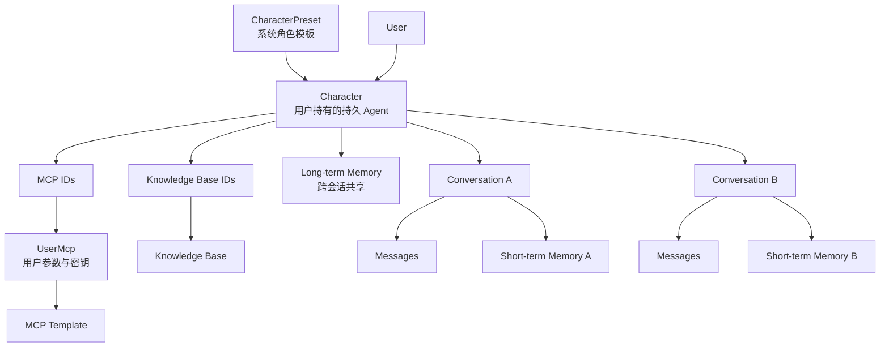
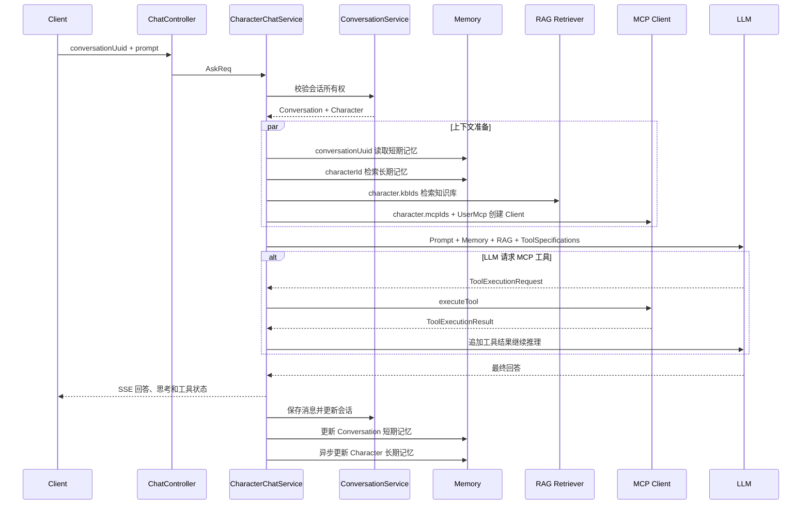

# Character 与 Conversation 轻量化改造计划书

> 文档状态：Draft / 二次复核修订版（实施前仍需完成 D0/R1 基线冻结）
> 适用范围：`server` 后端，涉及 `zhimesh-common`、`zhimesh-chat`、`zhimesh-admin`、`db_migration` 及聊天前端  
> 核心决策：保留 `Character` 作为持久 Agent，只新增 `Conversation` 隔离具体对话、消息和短期记忆  
> 实施策略：先修正确性问题，再增量加会话；兼容旧接口，不重写现有 RAG、MCP、长期记忆和 LLM 编排链路

## 0. 二次复核结论与实施门禁

本轮结合当前代码再次复核后，确认总体方向不变，但原草案存在若干不能直接照抄实施的细节。本修订版已把以下事项提升为强制约束：

1. `is_default` 必须进入 Conversation 正式 DDL，并由数据库条件唯一索引保证并发唯一，不能只靠标题或“最近会话”推断。
2. Conversation 消息分页索引必须匹配实际查询条件 `conversation_id + parent_message_id + id desc`，不能只建 `create_time` 索引。
3. SSE 的 `complete` 事件不能先于消息持久化成功发送；PostgreSQL、MapDB 和异步长期记忆不能被描述为一个原子事务。
4. MapDB 兼容迁移必须显式同时拿到 `conversationUuid`、`characterUuid` 和 `isDefault`；通用 `ChatMemoryStore` 仅凭一个 memoryId 无法推导旧 Key。
5. 标准 Chunk 的 FAILED 重试、唯一约束、ACTIVE 唯一性、索引构建版本和共享图谱版本隔离必须在 Schema 层表达。
6. 图谱抽取“合法空结果”与“模型空响应/解析失败”必须区分；合法无实体 Chunk 不能导致整篇文档失败。
7. 逐 Chunk 抽取不能假定天然覆盖跨 Chunk 关系，必须增加相邻窗口或文档级归并阶段及对应测试。
8. 回填、切换、清理都必须有持久化任务状态和恢复点，不能依赖 JVM 内存状态或一次性大事务。

实施前硬门禁分为两类：

- **任何后端改造前**：冻结 E0～E4 回答文件、配置、测试集 Hash、代码状态（提交号或完整补丁）、数据库/知识库快照。RAGAS 评分可以在冻结后离线继续。
- **RAG 入库链路切换前**：完成 RAGAS/确定性汇总、旧新链路影子对比、回滚演练和版本隔离验证。未满足时只能增加 Schema、只读接口和关闭状态的代码。

## 1. 改造结论

本项目当前不需要进行完整的 Agent 领域重构，也不需要立即新增独立的 `adi_agent`、`adi_agent_mcp`、`adi_agent_knowledge_base` 等模型。

结合现有代码和产品语义，推荐将当前概念明确为：

```text
Character = 用户拥有的持久 Agent
Conversation = 使用某个 Character 开启的一次独立聊天
CharacterMessage = Conversation 中的消息
```

其中：

- Character 继续保存人设、System Prompt、MCP、知识库、模型参数、联网与语音配置。
- Character 长期记忆继续以 `characterId` 为作用域，使同一角色在不同会话中保留长期认知。
- Conversation 只负责会话标题、消息归属和短期上下文隔离。
- 一个 Character 可以创建多个 Conversation。
- 现有 RAG、MCP、SSE、工作流、阻塞调用和模型工具调用循环保持原样。

简化后的核心关系：

```text
CharacterPreset
  └─实例化→ Character（持久 Agent）
                 ├─ MCP 配置
                 ├─ RAG 知识库
                 ├─ 长期记忆
                 ├─ Conversation A
                 │    ├─ Message
                 │    └─ 短期记忆
                 └─ Conversation B
                      ├─ Message
                      └─ 短期记忆
```

## 2. 为什么改成轻量方案

原完整方案能够支持 Agent 市场、配置版本、复杂权限和远程 Agent，但对于当前项目会带来较大的数据迁移与回归成本：

- Character 配置需要迁入新 Agent 表。
- CharacterMessage 需要全量迁移。
- 长期记忆向量元数据需要重建。
- MCP、知识库逗号字段需要同时关系化。
- 前端、外部 API、工作流和聊天接口都需要切换标识。

当前最实际的问题并不是缺少 Agent 实体，而是：

1. 一个 Character 无法自然承载多个相互隔离的话题。
2. 短期记忆使用 `characterUuid`，不同会话存在上下文混用风险。
3. 消息只关联 Character，无法明确属于哪一段会话。
4. MCP 链路存在若干确定性和安全问题，需要优先修复。

因此，本计划采用“修正确性 + 增加 Conversation”的最小改造路径，把整体复杂度从中高降低到中等。

## 3. 改造目标

完成后必须达到：

- 一个 Character 可以创建多个 Conversation。
- 不同 Conversation 的消息和短期记忆完全隔离。
- 同一 Character 的长期记忆可以跨 Conversation 共享。
- Character 原有的 System Prompt、MCP、RAG、模型与语音能力不丢失。
- 旧请求仍能使用 `characterUuid` 聊天，并自动落入默认 Conversation。
- 新请求可以通过 `conversationUuid` 精确定位会话。
- MCP 用户配置更新、Character MCP 编辑、系统停用校验、参数校验和敏感日志问题得到修复。
- 改造可以通过开关关闭，新链路故障时能够回退旧行为。

## 4. 暂不改造的内容

以下设计保持现状：

| 现有设计 | 处理决定 | 原因 |
|---|---|---|
| `Character` 实体 | 保留 | 已具备完整 Agent 能力配置 |
| `CharacterPreset` | 保留 | 可继续作为 Agent 模板 |
| 长期记忆绑定 `characterId` | 保留 | 符合持久角色跨会话记忆语义 |
| `Character.mcpIds` | 暂时保留 | 当前绑定规模有限，关系表收益不紧迫 |
| `Character.kbIds` | 暂时保留 | 不影响新增 Conversation |
| `UserMcp` | 保留 | 系统模板与用户私有配置两层设计合理 |
| RAG 检索链路 | 保留 | 与 Conversation 拆分没有直接冲突 |
| MCP 工具发现与递归执行 | 保留 | 核心执行链路已经完整 |
| SSE 与 TTS | 保留 | 只补充 Conversation 上下文 |
| 工作流 `AgentNode` | 保留 | 继续使用 Character 作为可执行 Agent |
| `adi_llm_call_record` | 保留 | 暂不新增完整 AgentRun 表 |

未来只有在出现明确需求时，再考虑：

- MCP、知识库改为关系表。
- 用户全局记忆与 Agent 长期记忆分域。
- Agent 配置版本与快照。
- 独立 AgentRun 和 MCP ToolCall 表。
- CharacterPreset 重命名为 AgentTemplate。
- 系统级共享 Agent 市场。

## 5. 实施原则

1. 先修复已有错误，再增加新模型。
2. 新字段先增加、先双写，不立即删除旧字段。
3. 新接口优先读取 Conversation，缺失时兼容 Character。
4. 长期记忆不迁移、不重建，降低最大风险。
5. RAG、MCP、LLM 编排只改入参来源，不重写执行逻辑。
6. 所有阶段都必须能够单独发布和回滚。
7. 每一阶段以验收结果完成为准，不以代码提交完成为准。

---

# 第一阶段：修复现有 MCP 与 Character 正确性问题

## 6.1 阶段目标

在不改变数据模型的情况下，先解决会直接导致配置不生效、停用失效、参数缺失和敏感信息泄漏的问题，为后续 Conversation 改造建立稳定基线。

## 6.2 修复用户 MCP 更新逻辑

当前 `UserMcpService.saveOrUpdate()` 在更新分支中构建了 `updateObj`，但最终调用：

```java
baseMapper.updateById(userMcp);
```

应改为更新实际承载新值的对象，并重新查询或正确组装返回 DTO：

```java
baseMapper.updateById(updateObj);
UserMcp saved = getById(userMcp.getId());
```

需要覆盖：

- 只修改 `isEnable`。
- 只修改用户参数。
- 同时修改参数和启用状态。
- 参数需要加密与不需要加密两种情况。
- 更新后返回 DTO 与数据库值一致。

### 验收结果

- 用户修改 MCP 参数能够真正写入数据库。
- 启用、停用状态立即生效。
- 敏感参数数据库中保持密文。

## 6.3 修复 Character MCP 编辑判断

当前 Character 编辑逻辑只在 `filteredMcpIds.isEmpty()` 时写入 `mcpIds`，条件与目标相反。

应明确三种语义：

```text
mcpIds == null：不修改原配置
mcpIds == []：清空绑定
mcpIds 非空：过滤后保存合法绑定
```

参考实现逻辑：

```java
if (characterEditReq.getMcpIds() != null) {
    List<Long> filtered = filterEnableMcpIds(characterEditReq.getMcpIds());
    one.setMcpIds(StringUtils.join(filtered, ","));
}
```

知识库 `kbIds` 也应采用同样的 null/空集合/非空集合语义，避免两个字段行为不一致。

### 验收结果

- Character 可以绑定一个或多个合法 MCP。
- 传空集合可以清空全部 MCP。
- 未提交 MCP 字段不会意外覆盖已有配置。
- 非当前用户启用的 MCP 会被过滤。

## 6.4 补充系统级 MCP 启用校验

运行时创建 MCP Client 必须同时满足：

```text
adi_mcp.is_deleted = false
adi_mcp.is_enable = true
adi_user_mcp.is_deleted = false
adi_user_mcp.is_enable = true
Character 已绑定该 MCP
```

`McpService.listByIds()` 可以增加是否仅查询启用记录的显式参数，或新增语义清晰的方法：

```java
listEnabledByIds(List<Long> ids, boolean decryptEnv)
```

不要让普通列表查询与运行时查询共用模糊行为。

### 验收结果

- 管理员停用 MCP 后，所有新聊天请求不再创建对应 Client。
- 已停用 MCP 不会继续向模型暴露工具。
- 恢复启用后，无需修改 Character 即可重新生效。

## 6.5 增加用户参数完整性校验

创建 MCP Client 前，根据 `customizedParamDefinitions` 验证：

- 必填参数是否存在。
- 参数值是否为空。
- 参数名是否属于定义集合。
- 加密标记与参数定义是否一致。
- 不允许用户提交未定义参数覆盖管理员预设参数。

建议返回结构化错误：

```text
MCP_CONFIG_INCOMPLETE
mcpId
mcpTitle
missingParameters
```

产品策略可以二选一：

1. 严格模式：任意已绑定 MCP 配置不完整，聊天前直接提示用户。
2. 容错模式：跳过不可用 MCP，继续聊天并通过 SSE/日志提示。

当前项目建议采用容错模式，避免一个工具配置问题阻断普通聊天；外部 API 可以提供严格模式参数。

### 验收结果

- 参数不完整的 MCP 不会创建无效 Client。
- 普通 LLM 聊天仍可继续。
- 前端能够明确提示缺少哪些配置。

## 6.6 修复 SSE 查询参数与敏感日志

当前 HTTP 参数直接使用字符串拼接，应使用 URI Builder 或 URL 编码工具。

同时调整：

- 敏感参数不得出现在 URL 普通日志中。
- 生产环境关闭 `logRequests(true)` 和 `logResponses(true)`，或启用脱敏拦截器。
- 工具执行结果可能包含隐私数据，不记录完整正文，只记录长度、状态、耗时和摘要。
- 异常日志不得打印解密后的参数对象。

### 验收结果

- 参数包含空格、中文、`&`、`=` 时仍能正确传输。
- 日志搜索不到真实 Token、API Key。
- MCP 调用仍有工具名、耗时、成功状态等可观测数据。

## 6.7 处理同名 MCP 工具

多个 MCP Server 可能同时暴露 `search` 等同名工具。最低限度应在工具发现阶段检测冲突：

```text
发现同名工具
→ 记录冲突
→ 跳过后加载者或拒绝本次 MCP 工具注入
```

后续可以引入命名空间：

```text
github.search
maps.search
```

第一阶段不要求实现完整重命名协议，但不能继续使用不确定的 HashMap 覆盖结果。

## 6.8 测试与交付

新增：

- `UserMcpServiceTest`
- `CharacterServiceMcpBindingTest`
- `McpRuntimeAvailabilityTest`
- `McpRequiredParametersTest`
- `McpSensitiveLoggingTest`
- `McpToolNameCollisionTest`

阶段交付结果：MCP 配置、启停、参数、日志和工具映射具备确定性，且未改变聊天数据模型。

---

# 第二阶段：新增轻量 Conversation 模型

## 7.1 阶段目标

新增 Conversation，但不替换 Character。使系统可以表达“同一个 Character 下的多段独立聊天”。

## 7.2 数据库迁移

建议新增：

```text
db_migration/014_add_conversation.sql
```

DDL 草案：

```sql
create table adi_conversation
(
    id                  bigserial primary key,
    uuid                varchar(32)  not null,
    user_id             bigint       not null,
    character_id        bigint       not null,
    title               varchar(100) not null default '',
    status              smallint     not null default 1,
    is_default          boolean      not null default false,
    last_message_time   timestamp,
    create_time         timestamp    not null default current_timestamp,
    update_time         timestamp    not null default current_timestamp,
    is_deleted          boolean      not null default false
);

create unique index uk_conversation_uuid
    on adi_conversation(uuid);

create index idx_conversation_user_update_time
    on adi_conversation(user_id, update_time desc);

create index idx_conversation_character_user
    on adi_conversation(character_id, user_id);
```

必须增加条件唯一索引，确保同一用户、同一 Character 最多只有一个有效默认会话：

```sql
create unique index uk_conversation_default_character
    on adi_conversation(user_id, character_id)
    where is_default = true and is_deleted = false;
```

如果项目暂时不使用外键，Service 层必须校验：

- Character 存在且未删除。
- `character.userId == conversation.userId`。
- 当前登录用户拥有 Conversation。

## 7.3 Java 模型

新增：

```text
Conversation.java
ConversationMapper.java
ConversationService.java
ConversationCreateReq.java
ConversationEditReq.java
ConversationDto.java
ConversationController.java
```

核心服务接口：

```java
Conversation create(Long userId, String characterUuid, String title);
Conversation getOwnedOrThrow(Long userId, String conversationUuid);
Page<ConversationDto> listByUser(Long userId, int page, int size);
void updateTitle(Long userId, String conversationUuid, String title);
void softDelete(Long userId, String conversationUuid);
Conversation getOrCreateDefault(Long userId, Character character);
```

## 7.4 默认 Conversation 策略

为了兼容旧客户端，每个 Character 可以按需创建一个默认 Conversation：

```text
旧请求只有 characterUuid
→ 只查询该 Character 的 is_default=true Conversation
→ 不存在则创建
→ 后续消息落入该 Conversation
```

禁止依赖固定标题或“最近活跃会话”判断默认会话。`is_default` 是正式字段，不再是可选建议：

```text
is_default boolean
```

`getOrCreateDefault()` 必须处理并发插入：先查询；插入发生唯一约束冲突时回滚当前插入并重新查询。不得用 JVM `synchronized` 代替数据库约束。

## 7.5 标题策略

- 新建 Conversation 初始标题为“新对话”。
- 第一条用户消息到达时，用前 45～100 字符更新标题。
- 后续可选用轻量模型异步生成标题，不影响主响应。
- 不再使用第一条消息修改 Character 标题。

## 7.6 API

```http
POST   /conversation/add
GET    /conversation/list
GET    /conversation/{uuid}
POST   /conversation/edit/{uuid}
POST   /conversation/del/{uuid}
```

创建请求：

```json
{
  "characterUuid": "character-uuid",
  "title": "可选"
}
```

## 7.7 测试与验收

- 一个 Character 能创建多个 Conversation。
- 用户无法查询、修改或删除其他用户的 Conversation。
- 删除 Character 时 Conversation 的处理策略明确：级联软删除或禁止删除。
- Character 的 MCP、知识库和长期记忆配置没有被复制。
- 旧聊天接口尚未修改，仍能正常运行。

阶段交付结果：Conversation 领域可以独立 CRUD，但聊天主链路仍保持原状。

---

# 第三阶段：消息关联 Conversation，并保持双写兼容

## 8.1 阶段目标

让每条新消息同时明确属于 Character 和 Conversation。Character 表示使用了哪个持久 Agent，Conversation 表示消息属于哪段具体聊天。

## 8.2 数据库迁移

建议新增：

```text
db_migration/015_message_add_conversation.sql
```

```sql
alter table adi_character_message
    add column conversation_id bigint not null default 0,
    add column conversation_uuid varchar(32) not null default '';

create index idx_character_message_conversation_page
    on adi_character_message(conversation_id, parent_message_id, id desc)
    where is_deleted = false;
```

索引必须匹配实际分页条件。`create_time` 可能相同，不能作为唯一游标；分页继续使用单调递增的 `id`。如果保留 `conversation_uuid` 冗余列，写入和回填时必须校验它与 Conversation 表一致。

必须保留：

```text
character_id
character_uuid
```

本轮不重命名 `adi_character_message`，避免影响现有引用表和 Mapper。

## 8.3 写入逻辑

`CharacterChatService.saveAfterAiResponse()` 保存用户问题和 AI 回答时增加：

```text
conversationId
conversationUuid
```

事务要求：

- 用户问题和 AI 回答必须写入同一个 Conversation。
- Conversation 字段写入失败时，消息事务回滚。
- 成功后更新 `last_message_time`。
- 第一条消息时更新 Conversation 标题。

事务边界必须进一步明确：

1. 用户消息、AI 消息、引用表、Conversation `touch` 和首条消息标题更新属于同一个 PostgreSQL 事务。
2. 当前代码在 `sendComplete()` 后才调用 `saveAfterAiResponse()`；改造时必须调整为“数据库提交成功 → 再发送 complete”，或明确发送 `persisted=false` 的失败事件，不能让客户端看到成功但数据库无消息。
3. `LLMCallRecordService.saveAsync()`、长期记忆和 MapDB 不属于该数据库事务。它们只能在事务提交后的回调/事件中执行，并具备失败重试；不能因这些副作用失败而回滚已经完成的聊天消息。
4. SSE 中断但模型已经完成时，是否保存回答必须固定策略。建议只要模型得到完整最终回答就保存，并记录客户端是否收到 complete。

## 8.4 查询逻辑

新增基于 Conversation 的查询：

```text
listByConversationUuid()
getMessageInConversation()
getPromptMessageInConversation()
```

重新生成回答时，除了校验问题 UUID，还必须校验该问题属于当前 Conversation，防止跨会话引用父消息。

原有 RAG/图谱/记忆引用表继续通过 `message_id` 关联，不需要修改。

## 8.5 历史消息处理

不要求本阶段一次性迁移全部历史消息。采用惰性兼容：

```text
旧消息 conversation_id = 0
→ 用户进入旧 Character
→ 创建默认 Conversation
→ 批量将该 Character 的旧消息补充到默认 Conversation
```

迁移必须幂等：

```sql
update adi_character_message
set conversation_id = :conversationId,
    conversation_uuid = :conversationUuid
where character_id = :characterId
  and user_id = :userId
  and is_deleted = false
  and conversation_id = 0;
```

对于旧模型“一 Character 一段对话”的数据，将全部消息归入默认 Conversation 是合理且可解释的。

回填与新写入并发时必须避免遗漏：

1. 为 Character 获取数据库级迁移锁，或先记录 `high_water_message_id`。
2. 先建立默认 Conversation，再让所有新消息双写 Conversation。
3. 分批回填 `id <= high_water_message_id and conversation_id=0` 的历史记录。
4. 最后补扫一次 `conversation_id=0`，确认数量为 0 后才标记该 Character 回填完成。
5. 回填任务保存最后处理 ID、扫描数、更新数和错误，不依赖进程内变量。

## 8.6 一致性指标

新增日志或指标：

- 新消息 Conversation 完整率。
- `message.characterId` 与 `conversation.characterId` 不一致数量。
- `message.userId` 与 `conversation.userId` 不一致数量。
- 历史消息待迁移数量。
- 默认 Conversation 自动创建数量。

## 8.7 测试与验收

- Conversation A 和 B 的消息分页完全隔离。
- 两段会话仍能共享同一 Character 配置。
- RAG 引用、图谱引用、记忆引用、附件、语音和思考内容不受影响。
- 重新生成回答不会跨 Conversation。
- 历史 Character 消息能够进入默认 Conversation。
- 新消息 Conversation 字段完整率为 100%。

阶段交付结果：消息实现 Character 能力归属与 Conversation 会话归属的双重表达。

---

# 第四阶段：聊天接口和短期记忆切换到 Conversation

## 9.1 阶段目标

新聊天请求使用 `conversationUuid` 隔离上下文；旧请求仅携带 `characterUuid` 时自动解析默认 Conversation。长期记忆继续绑定 Character。

## 9.2 请求 DTO

迁移期 `AskReq` 同时支持：

```json
{
  "characterUuid": "character-uuid",
  "conversationUuid": "conversation-uuid",
  "prompt": "用户问题"
}
```

解析规则：

```text
有 conversationUuid
→ 校验 Conversation 所有权
→ 从 Conversation 得到 Character
→ 如果请求还传了 characterUuid，必须一致

没有 conversationUuid，但有 characterUuid
→ 获取或创建该 Character 的默认 Conversation

两者都没有
→ 返回参数错误
```

后续新版本接口可以只要求 `conversationUuid`，但本轮不删除 `characterUuid`。

## 9.3 统一聊天上下文

建议引入轻量上下文对象：

```java
public record ChatContext(
        User user,
        Character character,
        Conversation conversation,
        String requestUuid) {
}
```

`CharacterChatService` 在入口只解析一次，后续 RAG、MCP、模型和持久化都使用同一个上下文，避免重复查询和标识不一致。

## 9.4 短期记忆改造

调整前：

```text
MapDB memoryId = characterUuid
```

调整后：

```text
MapDB memoryId = conversationUuid
```

禁止业务层直接使用裸字符串，增加统一方法：

```java
String shortTermMemoryKey(Conversation conversation) {
    return "conversation:" + conversation.getUuid();
}
```

兼容迁移不能只包装 `ChatMemoryStore.getMessages(memoryId)`。该接口只收到一个 Key，无法知道对应的旧 `characterUuid`，也无法判断是否默认 Conversation。正确做法是在构建 `ChatModelRequest` 前显式迁移：

```text
ChatContextResolver 得到 Character + Conversation
→ ShortTermMemoryMigrationService.ensureMigrated(characterUuid, conversationUuid, isDefault)
→ 默认 Conversation 且新 Key 不存在时，读取旧 Character Key
→ 在同一个 MapDB 临界区复制到 conversation Key
→ 写入迁移标记，复制成功前绝不删除旧 Key
→ 非默认 Conversation 永不读取旧 Character Key
```

注意：如果一个旧 Character 后续已经创建多个 Conversation，旧 Character 短期记忆只能迁入默认 Conversation，不能复制到全部 Conversation。

MapDB 与 PostgreSQL 不是同一事务资源。Conversation 删除后应先软删除数据库记录，再通过持久化清理任务删除 `conversation:{uuid}`；删除失败可重试，不能在数据库事务中假装原子完成。

## 9.5 长期记忆保持不变

长期记忆继续使用：

```text
characterId
```

原因：Character 被定义为持久 Agent，同一个 Character 的多个 Conversation 本来就应共享长期偏好和事实。

写入链路仍然是：

```text
一次 Conversation 完成回答
→ 提取长期事实/事件
→ 写入 Character 长期记忆
```

检索链路仍然是：

```text
加载 Conversation
→ 找到 Character
→ 使用 characterId 检索长期记忆
```

这一设计避免了长期记忆向量重建，是本次轻量化的主要降风险点。

## 9.6 RAG 和 MCP 保持方式

通过 Conversation 找到 Character 后，继续执行现有逻辑：

```text
character.kbIds → RAG 检索
character.mcpIds → 用户 MCP 过滤 → 创建 MCP Client
```

不改变：

- `CharacterChatHelper.retrieve()` 的检索职责。
- `buildChatRequestParams()` 的请求构造职责。
- `McpToolProvider` 工具发现。
- `executeTool()` 工具执行。
- 最大工具递归深度。
- MCP Client 关闭逻辑。

## 9.7 SSE 事件

建议所有 SSE 事件增加或保留可追踪的：

```text
conversationUuid
messageUuid
requestUuid
```

工具调用事件继续包含：

- 工具名。
- 耗时。
- 成功状态。

但不返回敏感参数和完整工具结果。

`complete` 事件必须携带持久化结果。推荐顺序是：模型结束 → PostgreSQL 事务保存消息/引用/Conversation → 事务提交 → 发送 complete → 投递 MapDB/长期记忆异步任务。若产品必须优先返回 Token 流，最后的 complete 仍必须等待持久化提交。

## 9.8 外部 API 与工作流

外部 API 迁移期可以继续通过 Character 执行无状态或默认会话聊天；新增可选 `conversationUuid` 支持连续会话。

工作流 `AgentNode` 继续使用 Character 作为 Agent：

```text
默认：stateless，不保存 Conversation 短期上下文
可选：显式传 conversationUuid，延续特定会话
```

不应在工作流中每次隐式创建大量 Conversation，除非节点配置明确要求持久会话。

## 9.9 测试与验收

- 同一 Character 的 Conversation A、B 不共享短期记忆。
- A、B 可以召回相同 Character 的长期记忆。
- 新请求只传 Conversation UUID 可以完成 RAG、MCP 和记忆链路。
- 旧请求只传 Character UUID 仍可正常聊天。
- SSE、阻塞模式、语音、重新生成和外部 API 行为不回退。
- 工作流默认无状态，不产生意外会话数据。

阶段交付结果：Conversation 成为短期聊天边界，Character 继续作为能力和长期记忆边界。

---

# 第五阶段：灰度、观测、兼容收敛与后续决策

## 10.1 阶段目标

安全放量新 Conversation 链路，验证其确实解决多会话隔离问题；稳定后只收敛旧行为，不删除仍有价值的 Character 模型。

## 10.2 特性开关

建议配置：

```yaml
zhimesh:
  conversation:
    enabled: true
    auto-create-default: true
    message-dual-write: true
    short-memory-use-conversation: false
    fallback-to-character-memory-key: true
```

切流顺序：

```text
A. Conversation 建表和 CRUD 上线
B. 消息写入 Conversation 字段
C. 新接口对内部用户开放
D. 短期记忆切换到 Conversation Key
E. 新用户默认使用多 Conversation
F. 全量用户切换
G. 停止旧 Character 短期 Key 写入
```

## 10.3 灰度范围

- 自动化测试环境。
- 内部测试用户。
- 新注册用户。
- 1%、10%、50%、100% 用户。
- 先文本聊天，再验证语音、外部 API、工作流和 MCP。

## 10.4 核心指标

| 维度 | 指标 |
|---|---|
| Conversation | 创建成功率、列表延迟、自动默认会话数量 |
| Message | Conversation 字段完整率、归属不一致数量 |
| Short Memory | 新 Key 命中率、旧 Key 回退率、跨会话污染反馈 |
| Long Memory | 跨 Conversation 召回成功率、错误记忆反馈率 |
| MCP | Client 创建成功率、工具发现率、执行成功率、参数缺失数 |
| RAG | 召回数量、引用完整率、P95 检索延迟 |
| Chat | 首 Token 延迟、总响应 P95、SSE 中断率、错误率 |
| Cost | 每次对话输入/输出 Token 与平均成本 |

## 10.5 回滚方案

Conversation 新链路出现问题时：

1. 关闭 `short-memory-use-conversation`，恢复旧 Character Key。
2. 保留 Conversation 数据，不删除。
3. 旧请求继续通过 `characterUuid` 工作。
4. 消息仍保留 Character 字段，可按旧逻辑查询。
5. 修复后重新开启灰度。

因为长期记忆、RAG、MCP 和 Character 配置均未迁移，所以回滚不需要重建向量数据或恢复复杂关系。

## 10.6 兼容收敛

稳定后可以：

- 前端新建聊天时显式创建 Conversation。
- 新版聊天 API 以 `conversationUuid` 为主要参数。
- 旧 `characterUuid` 请求保留一个明确兼容版本。
- 停止写旧 Character 短期记忆 Key。
- 保留消息的 Character 字段，用于能力归属和历史查询。

本计划不要求删除 Character，也不要求删除 `mcpIds/kbIds`。

## 10.7 后续是否继续重构的判断条件

只有满足以下真实业务需求之一，才启动下一轮完整 Agent 化：

- 同一个 Agent 需要被大量用户共享，而不是每个用户复制 Character。
- Agent 配置需要版本快照和历史行为复现。
- MCP、知识库绑定需要独立策略、排序、阈值或工具级权限。
- 需要查询 MCP/知识库被哪些 Agent 使用。
- 需要用户全局记忆、Agent 全局记忆和团队共享记忆。
- 需要远程 Agent/A2A 注册、发现和调用。
- 需要完整 AgentRun、ToolCall 和审计记录。

如果没有上述需求，当前轻量模型可以长期保留。

## 10.8 最终验收结果

- 一个 Character 下可以稳定创建多个 Conversation。
- 不同 Conversation 消息和短期记忆完全隔离。
- Character 的长期记忆、MCP、RAG 和模型配置可复用。
- 新旧接口均可工作，旧功能无损。
- MCP 关键正确性与安全问题全部有自动化测试。
- 新链路全量运行后，旧短期 Key 回退率降至 0。
- 没有执行不必要的长期记忆迁移和完整 Agent 重构。

---

# 11. 持续改进安排

## 11.1 里程碑

| 里程碑 | 主要交付 | 退出条件 |
|---|---|---|
| M1 MCP 稳定性 | 更新、绑定、启停、参数与日志修复 | 自动化测试通过，敏感日志为 0 |
| M2 Conversation 骨架 | 表、实体、CRUD、权限 | 一个 Character 可创建多个会话 |
| M3 消息双归属 | 消息增加 Conversation 字段 | 新消息字段完整率 100% |
| M4 短期记忆隔离 | 请求解析、Conversation Key | 多会话隔离测试通过 |
| M5 全量灰度 | 指标、回退、兼容收敛 | 错误率稳定，旧 Key 回退率为 0 |

## 11.2 每阶段必备产物

- 数据库迁移脚本。
- 变更和回滚说明。
- 单元测试、集成测试、端到端回归。
- API 和 Swagger 更新。
- 指标与告警。
- 灰度结果记录。
- 重要决策 ADR。

## 11.3 Definition of Done

阶段完成必须同时满足：

1. 功能代码和测试完成。
2. 数据库迁移可重复执行或具备明确幂等约束。
3. 新指标能够观察实际运行状态。
4. 回滚开关在预发布环境验证。
5. 原有 RAG、MCP、记忆和聊天回归通过。
6. 没有未解释的数据不一致。

---

# 12. 改造交付执行手册

本章是实际实施时的主操作清单。前面的五阶段说明“为什么改、改成什么”，本章按照可独立合并、可独立验证、可独立回退的交付批次说明“具体怎么改”。

任何批次不得跳过本批次的测试和验收证据直接进入下一批次。

## 12.1 交付批次总览

| 批次 | 目标 | 是否改变线上行为 | 主要产物 |
|---|---|---:|---|
| D0 | 建立基线和开关 | 否 | 基线报告、配置项、回归用例 |
| D1 | 修复 MCP/Character 正确性 | 是 | Bug 修复、参数校验、安全日志 |
| D2 | 建立 Conversation 骨架 | 否 | DDL、实体、Mapper、Service、CRUD |
| D3 | 消息增加 Conversation 归属 | 小范围 | 双写、历史补齐、会话消息查询 |
| D4 | 聊天入口解析 Conversation | 可灰度 | AskReq、ChatContext、默认会话 |
| D5 | 短期记忆切换 | 可灰度 | 新 Key、旧 Key 回退、隔离测试 |
| D6 | 外部 API、工作流与前端收敛 | 是 | 兼容接口、联调记录 |
| D7 | 全量灰度和交付验收 | 是 | 指标报告、回滚演练、交付包 |

推荐每个批次单独提交，不把数据库、核心聊天、记忆切换和旧逻辑清理混在一个提交中。

## 12.2 D0：建立改造基线与特性开关

### 12.2.1 目标状态

本批次结束后，系统行为与改造前完全一致，但已经具备：

- 可复现的构建和测试结果。
- 聊天、RAG、MCP、记忆的回归样例。
- Conversation 灰度开关。
- 数据库改造前的数据量快照。

### 12.2.2 建立分支与工作区检查

执行前记录：

```powershell
git status --short
git branch --show-current
git rev-parse HEAD
```

要求：

- 不覆盖已有未提交修改。
- 将基线提交号记录在交付报告。
- 数据库迁移前完成备份或快照。

### 12.2.3 构建基线

在 `server` 目录执行：

```powershell
mvn -pl zhimesh-common test
mvn -pl zhimesh-bootstrap -am package -DskipTests
```

记录：

- Maven、JDK 版本。
- 测试数量、失败数量。
- 构建耗时。
- 已知失败测试及原因。

如果已有测试依赖本地 PostgreSQL、Neo4j 或模型服务，应把纯单元测试和环境集成测试分开，不能把环境缺失当成代码通过。

### 12.2.4 建立功能回归样例

至少准备以下固定样例，并保存输入、关键配置和预期行为：

1. 无 RAG、无 MCP 的普通文本聊天。
2. 携带短期上下文的两轮聊天。
3. 能命中长期记忆的聊天。
4. 只使用向量 RAG 的聊天。
5. 同时使用向量和图谱 RAG 的聊天。
6. MCP 工具发现但模型不调用工具。
7. MCP 工具成功调用。
8. MCP 工具执行失败但聊天能正确结束。
9. SSE 流式回答。
10. 阻塞模式回答。
11. 语音/图片路径中当前环境能够执行的部分。
12. 工作流 AgentNode 调用 Character。

每个样例至少记录：

```text
characterUuid
用户输入
使用的模型
是否启用 RAG/MCP/记忆
返回状态
消息写入数量
引用记录数量
是否产生工具调用
短期记忆消息数量
```

### 12.2.5 增加 Conversation 配置

修改：

```text
zhimesh-common/src/main/java/com/pppp/zhimesh/common/config/ZhiMeshProperties.java
zhimesh-bootstrap/src/main/resources/application.yml
zhimesh-bootstrap/src/main/resources/application-dev.yml.example
zhimesh-bootstrap/src/main/resources/application-prod.yml
```

在 `ZhiMeshProperties` 中增加：

```java
private Conversation conversation = new Conversation();

@Data
public static class Conversation {
    private boolean enabled = false;
    private boolean autoCreateDefault = false;
    private boolean messageDualWrite = false;
    private boolean shortMemoryUseConversation = false;
    private boolean fallbackToCharacterMemoryKey = true;
}
```

基础配置默认全部不改变现有行为：

```yaml
zhimesh:
  conversation:
    enabled: false
    auto-create-default: false
    message-dual-write: false
    short-memory-use-conversation: false
    fallback-to-character-memory-key: true
```

### 12.2.6 数据快照 SQL

迁移前记录以下数量：

```sql
select count(*) as character_count
from adi_character
where is_deleted = false;

select count(*) as message_count
from adi_character_message
where is_deleted = false;

select character_id, count(*) as message_count
from adi_character_message
where is_deleted = false
group by character_id
order by message_count desc;

select count(*) as enabled_user_mcp_count
from adi_user_mcp
where is_deleted = false and is_enable = true;
```

输出保存为发布附件，后续用于迁移数量核对。

### 12.2.7 测试

新增：

```text
zhimesh-common/src/test/java/com/pppp/zhimesh/common/config/ZhiMeshPropertiesConversationTest.java
```

覆盖：

- 无配置时默认值安全。
- YAML 字段可以正确绑定。
- 开关关闭时现有聊天不解析 Conversation。

### 12.2.8 验收证据

- 基线提交号和 `git status`。
- Maven 测试与构建日志。
- 回归样例结果。
- 数据库基线统计。
- 配置绑定测试结果。

### 12.2.9 回滚

只需要回滚配置类和 YAML；本批次没有数据库与业务数据变化。

## 12.3 D1：修复 MCP 与 Character 确定性问题

### 12.3.1 修改用户 MCP 更新

修改文件：

```text
zhimesh-common/src/main/java/com/pppp/zhimesh/common/service/UserMcpService.java
```

操作步骤：

1. 在更新分支中保留 `updateObj.id`。
2. 把 `mcpCustomizedParams` 和 `isEnable` 写入 `updateObj`。
3. 使用 `baseMapper.updateById(updateObj)`，不能更新旧 `userMcp`。
4. 更新后按 ID 回查数据库。
5. 使用回查对象组装 `UserMcpDto`。
6. DTO 返回前不得意外修改数据库实体中的密文对象；必要时深拷贝参数列表。

预期伪代码：

```java
UserMcp updateObj = new UserMcp();
updateObj.setId(userMcp.getId());
// 按非 null 字段赋值
baseMapper.updateById(updateObj);
UserMcp saved = getById(userMcp.getId());
return toDto(saved, mcp);
```

### 12.3.2 修复 Character MCP 编辑

修改文件：

```text
zhimesh-common/src/main/java/com/pppp/zhimesh/common/service/CharacterService.java
```

操作步骤：

1. 删除 `filteredMcpIds.isEmpty()` 才赋值的错误条件。
2. `mcpIds == null` 时不修改。
3. `mcpIds` 为空集合时保存空字符串。
4. 非空集合先调用 `filterEnableMcpIds()` 再保存。
5. 对 `kbIds` 复核同样的三态语义。
6. 更新后回查 Character 并验证 DTO 中 MCP IDs 与数据库一致。

### 12.3.3 分离运行时 MCP 查询

修改：

```text
zhimesh-common/src/main/java/com/pppp/zhimesh/common/service/McpService.java
zhimesh-common/src/main/java/com/pppp/zhimesh/common/service/UserMcpService.java
```

新增语义明确的方法：

```java
List<Mcp> listRuntimeEnabledByIds(List<Long> ids, boolean decryptEnv);
```

查询条件必须包含：

```text
id in ids
is_deleted = false
is_enable = true
```

`createMcpClients()` 只能调用运行时方法，公共列表接口仍可按自身需求展示停用状态。

### 12.3.4 参数校验器

建议新增：

```text
zhimesh-common/src/main/java/com/pppp/zhimesh/common/service/McpRuntimeConfigValidator.java
zhimesh-common/src/main/java/com/pppp/zhimesh/common/vo/McpValidationResult.java
```

校验顺序：

1. 模板存在且系统启用。
2. UserMcp 存在且用户启用。
3. `customizedParamDefinitions` 为空时直接通过。
4. 将用户参数按 name 构建 Map，发现重复名称时报错。
5. 对每个定义检查必填值。
6. 用户参数不得覆盖管理员 preset 参数。
7. 校验结束后才解密敏感参数。

本项目采用容错策略：

```text
某个 MCP 校验失败
→ 记录 mcpId、用户 ID、缺失参数名
→ 跳过该 MCP
→ 其他 MCP 和普通聊天继续
```

不得记录参数值。

### 12.3.5 安全构建 Transport

修改 `UserMcpService`：

1. 使用 URI Builder/编码工具生成 SSE URL。
2. 禁止使用裸 `key=value&` 拼接。
3. 生产环境关闭 MCP 请求/响应正文日志。
4. 将日志改为 MCP ID、标题、Transport 类型、耗时和结果状态。
5. stdio 参数如果可能包含多个参数，先定义明确的参数数组格式；不要默认把整段字符串当成一个参数。

如果短期内不能改变 `stdio_arg` 数据结构，文档和校验必须明确其当前只支持单一参数。

### 12.3.6 工具名冲突检测

修改：

```text
zhimesh-common/src/main/java/com/pppp/zhimesh/common/languagemodel/AbstractLLMService.java
```

在 `getRequestTools()` 中：

1. 建立 `toolName -> McpClient` 映射。
2. 插入前检查名称是否已存在。
3. 冲突时记录两个 MCP 的可识别信息。
4. 第一版选择“拒绝冲突工具”，而不是无提示覆盖。
5. 给模型的 ToolSpecifications 与执行映射必须来自同一份去重结果。

### 12.3.7 错误码和国际化

修改：

```text
zhimesh-common/src/main/java/com/pppp/zhimesh/common/enums/ErrorEnum.java
zhimesh-common/src/main/resources/i18n/messages.properties
zhimesh-common/src/main/resources/i18n/messages_zh_CN.properties
```

建议增加：

```text
A_MCP_CONFIG_INCOMPLETE
A_MCP_TOOL_NAME_CONFLICT
```

避免继续用笼统 `A_PARAMS_ERROR` 导致前端无法提示。

### 12.3.8 测试清单

新增或扩展：

```text
UserMcpServiceTest
CharacterServiceMcpBindingTest
McpRuntimeConfigValidatorTest
McpServiceRuntimeQueryTest
McpToolConflictTest
```

必须覆盖：

- 已有 UserMcp 参数更新。
- 启用和停用切换。
- Character 非空 MCP 列表更新。
- Character 清空 MCP。
- 管理员停用后运行时过滤。
- 缺少一个必填参数。
- 含中文、空格、`&`、`=` 的参数编码。
- 两个 MCP 提供同名工具。
- 日志字符串中不含测试 Token。

执行：

```powershell
mvn -pl zhimesh-common -Dtest=UserMcpServiceTest,CharacterServiceMcpBindingTest,McpRuntimeConfigValidatorTest,McpServiceRuntimeQueryTest,McpToolConflictTest test
mvn -pl zhimesh-common test
```

### 12.3.9 验收与回滚

验收：

- 数据库中的更新值与请求一致。
- 被系统停用 MCP 不出现在 ToolSpecifications。
- 配置不完整只跳过对应 MCP。
- 测试日志不出现 Token。

回滚：只回滚业务代码；本批次不修改表结构。注意不要回滚已经由用户正确写入的新配置数据。

## 12.4 D2：交付 Conversation 数据模型和 CRUD

### 12.4.1 创建数据库脚本

新增：

```text
db_migration/014_add_conversation.sql
```

脚本内容除建表和索引外，还要包括：

- 表和字段 COMMENT。
- `update_time` 触发器，与项目其他表保持一致。
- UUID 唯一索引。
- `is_default boolean not null default false` 正式字段。
- 用户会话列表索引。
- Character 与用户组合索引。

增加 `is_default` 后建议条件唯一索引：

```sql
create unique index uk_conversation_default_character
on adi_conversation(user_id, character_id)
where is_default = true and is_deleted = false;
```

这能从数据库层避免并发创建两个默认 Conversation。

### 12.4.2 同步完整 DDL

项目以 `all_ddl.sql` 表达完整初始化结构，因此同时修改：

```text
db_migration/all_ddl.sql
```

要求增量脚本和完整 DDL 的字段、默认值、索引、COMMENT 完全一致。

### 12.4.3 新增实体和 Mapper

新增：

```text
zhimesh-common/src/main/java/com/pppp/zhimesh/common/entity/Conversation.java
zhimesh-common/src/main/java/com/pppp/zhimesh/common/mapper/ConversationMapper.java
```

`Conversation extends BaseEntity`，字段：

```text
uuid
userId
characterId
title
status
isDefault
lastMessageTime
```

Mapper 继承 `BaseMapper<Conversation>`，不在 Mapper 中写业务权限。

### 12.4.4 新增 DTO

建议目录：

```text
zhimesh-common/src/main/java/com/pppp/zhimesh/common/dto/conversation/
├── ConversationCreateReq.java
├── ConversationEditReq.java
├── ConversationListReq.java
└── ConversationDto.java
```

约束：

- `characterUuid` 长度 32。
- title 最大 100。
- pageSize 最大 100。
- DTO 不暴露数据库软删除字段。

### 12.4.5 新增错误码

增加：

```text
A_CONVERSATION_NOT_FOUND
A_CONVERSATION_NOT_AUTHORIZED
A_CONVERSATION_CHARACTER_MISMATCH
```

同时补充中英文 i18n。

### 12.4.6 实现 ConversationService

新增：

```text
zhimesh-common/src/main/java/com/pppp/zhimesh/common/service/ConversationService.java
```

逐个实现：

1. `create()`：校验 Character 属于当前用户，生成 UUID，保存。
2. `getOwnedOrThrow()`：UUID、userId、未删除三条件查询。
3. `listByUser()`：按 `updateTime` 倒序分页。
4. `editTitle()`：只允许所有者操作。
5. `softDelete()`：先定义消息和短期记忆清理策略。
6. `getOrCreateDefault()`：先查默认会话，无记录时创建，并处理唯一索引并发冲突后回查。
7. `touch()`：消息完成后更新 `lastMessageTime`，不要在流式响应每个 Token 时更新。

`getOrCreateDefault()` 必须在并发测试中保证同一用户同一 Character 只有一个默认会话。

### 12.4.7 新增 Controller

新增：

```text
zhimesh-chat/src/main/java/com/pppp/zhimesh/chat/controller/ConversationController.java
```

接口：

```text
POST /conversation/add
GET  /conversation/list
GET  /conversation/{uuid}
POST /conversation/edit/{uuid}
POST /conversation/del/{uuid}
```

Controller 只负责参数与当前用户，不直接操作 Mapper。

### 12.4.8 数据库验证 SQL

执行迁移后验证：

```sql
select column_name, data_type, is_nullable, column_default
from information_schema.columns
where table_name = 'adi_conversation'
order by ordinal_position;

select indexname, indexdef
from pg_indexes
where tablename = 'adi_conversation';
```

### 12.4.9 测试

```text
ConversationServiceTest
ConversationDefaultConcurrencyTest
ConversationControllerTest
ConversationMapperTest
```

覆盖：

- 正常创建。
- 非本人 Character 拒绝创建。
- 默认会话并发唯一。
- 分页顺序。
- 删除和重复删除。
- 用户隔离。

执行：

```powershell
mvn -pl zhimesh-common test
mvn -pl zhimesh-chat -am test
```

### 12.4.10 验收与回滚

验收证据：DDL 验证、CRUD Swagger 截图/响应、权限测试、并发测试。

回滚时先关闭 `zhimesh.conversation.enabled`。表可以保留为空，不要在同一次发布中执行 DROP。

## 12.5 D3：交付消息 Conversation 双归属

### 12.5.1 数据库脚本

新增：

```text
db_migration/015_message_add_conversation.sql
```

操作：

```sql
alter table adi_character_message
    add column conversation_id bigint not null default 0,
    add column conversation_uuid varchar(32) not null default '';

create index idx_character_message_conversation_page
    on adi_character_message(conversation_id, parent_message_id, id desc)
    where is_deleted = false;
```

同步 `all_ddl.sql`。

### 12.5.2 更新实体

修改：

```text
zhimesh-common/src/main/java/com/pppp/zhimesh/common/entity/CharacterMessage.java
```

增加：

```java
private Long conversationId;
private String conversationUuid;
```

旧 `characterId/characterUuid` 不删除。

### 12.5.3 增加消息查询方法

修改 `CharacterMessageService`，新增：

```java
List<CharacterMessage> listQuestionsByConversationId(long conversationId, long maxId, int pageSize);
CharacterMessage getOwnedQuestionInConversation(String questionUuid, Long conversationId, Long userId);
long countByConversationId(Long conversationId);
```

分页条件保持：

```text
conversation_id
parent_message_id = 0
id < maxId
is_deleted = false
order by id desc
limit pageSize
```

不能把 pageSize 直接拼接未经验证的字符串；Controller/Service 应限制 1～100。

### 12.5.4 修改保存方法签名

`CharacterChatService.saveAfterAiResponse()` 增加 Conversation 上下文。推荐不要继续扩大参数列表，而是传 `ChatContext`。

保存用户问题和 AI 回答时同时设置：

```text
characterId
characterUuid
conversationId
conversationUuid
userId
```

保存完成后：

1. 更新 Conversation 最后消息时间。
2. 第一条消息更新标题。
3. RAG/图谱/记忆引用仍使用 AI Message ID。
4. 短期记忆本批次暂不切换。

### 12.5.5 历史数据补齐服务

建议新增：

```text
zhimesh-common/src/main/java/com/pppp/zhimesh/common/service/ConversationBackfillService.java
```

方法：

```java
BackfillResult backfillCharacter(Long userId, Long characterId);
```

步骤：

1. 锁定或幂等查询该 Character 的默认 Conversation。
2. 不存在则创建。
3. 只更新 `conversation_id = 0` 的消息。
4. 分批更新，避免大事务锁表。
5. 返回扫描数、更新数、跳过数、失败数。
6. 每批提交后记录最后处理的 Message ID。
7. 查询和更新同时限制 `user_id`、`character_id`、`is_deleted=false`。
8. 使用持久化高水位和最终补扫，处理回填期间产生的新消息。

不建议把用户级回填暴露为无保护公共接口。可由管理员接口、启动后受控任务或离线命令触发。

### 12.5.6 数据一致性校验

```sql
select count(*)
from adi_character_message
where is_deleted = false
  and conversation_id = 0;

select count(*)
from adi_character_message m
join adi_conversation c on c.id = m.conversation_id
where m.conversation_id > 0
  and (m.character_id <> c.character_id or m.user_id <> c.user_id);
```

第二条必须为 0。

### 12.5.7 测试

```text
CharacterMessageConversationQueryTest
CharacterChatMessageDualWriteTest
ConversationBackfillServiceTest
ConversationMessageIsolationTest
```

覆盖：

- 用户和助手消息写入同一 Conversation。
- 两个 Conversation 分页隔离。
- 父子消息不跨会话。
- 回填重复执行结果不变。
- 回填不会覆盖已经属于其他 Conversation 的消息。
- 引用表仍指向正确 AI Message。

### 12.5.8 开关与发布

先上线字段和读代码，再开启：

```yaml
zhimesh.conversation.message-dual-write: true
```

观察新消息字段完整率后再运行历史回填。

### 12.5.9 回滚

关闭双写开关，旧 Character 消息字段仍可读。新增字段和已写数据保留，不能为了回滚清空 Conversation 数据。

## 12.6 D4：交付 Conversation 聊天入口

### 12.6.1 修改 AskReq

修改：

```text
zhimesh-common/src/main/java/com/pppp/zhimesh/common/dto/AskReq.java
```

增加：

```java
@Length(min = 32, max = 32)
private String conversationUuid;
```

迁移期 `characterUuid` 不再单独强制必填，而是要求：

```text
conversationUuid 与 characterUuid 至少一个存在
```

### 12.6.2 修改 AskReqValidator

当前校验器直接对 `value.getCharacterUuid()` 做 Pattern.matches，空值会出错。修改为：

1. 校验 value 非空。
2. prompt/regenerate/audio 至少一个存在。
3. conversationUuid、characterUuid 至少一个存在。
4. 非空 UUID 分别校验 32 位 UUID v4 格式。
5. 两个都存在时，格式校验通过后把一致性校验留给 Service。
6. Validator 返回 false 并构造约束消息，尽量不要直接抛 `IllegalArgumentException`。

### 12.6.3 新增 ChatContextResolver

新增：

```text
zhimesh-common/src/main/java/com/pppp/zhimesh/common/service/ChatContextResolver.java
zhimesh-common/src/main/java/com/pppp/zhimesh/common/vo/ChatContext.java
```

解析算法：

```text
if conversationUuid 非空:
    按当前用户读取 Conversation
    按 conversation.characterId 读取 Character
    如果请求含 characterUuid 且不一致，拒绝
else:
    按当前用户读取 Character
    如果 autoCreateDefault 开启，获取或创建默认 Conversation
    否则使用旧模式
```

`ChatContext` 至少包含：

```text
User
Character
Conversation（兼容旧模式时可空）
requestUuid
```

### 12.6.4 改造 CharacterChatService 入口

逐步修改：

1. `sseAsk()` 在异步分发前保留当前用户信息。
2. `asyncCheckAndChat()` 开始时调用 `ChatContextResolver`。
3. 后续 Character 不再重复按 UUID 查询。
4. 构造 ChatModelRequest 时仍传 Character。
5. 保存消息时传 Conversation。
6. 错误日志同时带 userId、characterUuid、conversationUuid、sseUuid。
7. `blockingAsk()` 使用同一个 Resolver，避免流式与阻塞两套解析规则。

### 12.6.5 防止越权与不一致

必须测试并拒绝：

- 用户 A 使用用户 B 的 conversationUuid。
- conversationUuid 属于 Character A，但请求传 Character B。
- Conversation 已删除。
- Conversation 有效但 Character 已删除或停用。
- 重新生成的 questionUuid 不属于当前 Conversation。

### 12.6.6 接口兼容矩阵

| characterUuid | conversationUuid | 行为 |
|---|---|---|
| 有 | 无 | 旧模式；按开关获取默认 Conversation |
| 无 | 有 | 新模式；从 Conversation 解析 Character |
| 有 | 有且一致 | 新模式 |
| 有 | 有但不一致 | 拒绝 |
| 无 | 无 | 参数错误 |

### 12.6.7 测试

```text
AskReqValidatorTest
ChatContextResolverTest
CharacterChatConversationIntegrationTest
BlockingChatConversationIntegrationTest
ConversationAuthorizationTest
RegenerateQuestionConversationTest
```

执行：

```powershell
mvn -pl zhimesh-common test
mvn -pl zhimesh-chat -am test
mvn -pl zhimesh-bootstrap -am package -DskipTests
```

### 12.6.8 灰度开关

先启用：

```yaml
zhimesh.conversation.enabled: true
zhimesh.conversation.auto-create-default: false
```

只允许显式 conversationUuid 的内部用户测试。验证后再打开自动默认会话。

### 12.6.9 回滚

关闭 `enabled` 和 `auto-create-default`，旧 characterUuid 路径继续工作。Conversation 数据和消息新字段保留。

## 12.7 D5：交付短期记忆 Conversation 隔离

### 12.7.1 保持 MapDBChatMemoryStore 通用，并增加显式迁移服务

`MapDBChatMemoryStore` 是通用 `ChatMemoryStore`，不能把 Character/Conversation 查询写进底层 Store。当前 `AbstractLLMService` 直接使用其单例，因此应在进入 LLM 前完成兼容迁移，再把最终 Key 传入；不要期望 Store 根据 `conversation:*` 反推出旧 Character Key。

新增：

```text
zhimesh-common/src/main/java/com/pppp/zhimesh/common/memory/shortterm/ShortTermMemoryKeyResolver.java
zhimesh-common/src/main/java/com/pppp/zhimesh/common/memory/shortterm/ShortTermMemoryMigrationService.java
zhimesh-common/src/main/java/com/pppp/zhimesh/common/memory/shortterm/ShortTermMemoryCleanupTask.java
```

### 12.7.2 Key 规则

新 Key：

```text
conversation:{conversationUuid}
```

旧 Key：

```text
{characterUuid}
```

所有新代码必须通过 Resolver 生成，禁止散落字符串拼接。

### 12.7.3 兼容读取算法

```text
if shortMemoryUseConversation = false:
    使用旧 Character Key
else:
    ChatContextResolver 已得到 Character 和 Conversation
    if 当前是默认 Conversation 且 fallbackToCharacterMemoryKey = true:
        调用 ensureMigrated(characterUuid, conversationUuid, true)
    使用 Resolver 生成的 Conversation Key
    非默认 Conversation 不执行任何旧 Key 回退
```

只有默认 Conversation 可以继承旧 Character Key，其他新 Conversation 必须从空短期上下文开始。

迁移操作必须在 MapDB 侧串行化“检查新 Key → 读取旧 Key → 写新 Key → commit”，并记录幂等迁移标记。多实例部署共享同一个 MapDB 文件不受支持；若未来需要多实例，应先把短期记忆迁移到 Redis/数据库，而不是让多个 JVM 打开同一文件。

灰度期增加 `short-memory-dual-write-default=true`：默认 Conversation 的完整短期消息列表在同一个 MapDB 临界区同时更新 Conversation Key 和旧 Character Key，并在一次 commit 后才视为成功。非默认 Conversation 绝不能写旧 Character Key，否则会重新造成会话污染。该双写是读取回滚能够保留灰度期新消息的前提；不能仅因旧 Key 尚未删除就宣称可无损回滚。

### 12.7.4 修改 ChatModelRequest memoryId

当前 `CharacterChatHelper.buildChatRequestParams()` 设置：

```java
builder.memoryId(character.getUuid());
```

改造方式：

- 方法增加 Conversation 或已解析的 memoryId 参数。
- Character 开启上下文理解时，优先使用 Conversation Key。
- 兼容模式使用 Character UUID。
- 不在 Helper 内部查询数据库。

建议方法签名逐步改成：

```java
buildChatRequestParams(
    Character character,
    Conversation conversation,
    String userPrompt,
    ...)
```

或者由 ChatContext 提供 `shortTermMemoryId()`。

### 12.7.5 修改回答后的短期记忆写入

`saveAfterAiResponse()` 当前直接以 `askReq.getCharacterUuid()` 读写 MapDB。改为从 `ChatContext` 获取解析后的 Key。

要求：

- 用户消息和 AI 消息写入当前 Conversation Key。
- 灰度期默认 Conversation 按开关同步写旧 Character Key；非默认 Conversation 始终只写自己的 Key。
- 回答失败不追加不完整 AI 消息。
- 删除 Conversation 时删除其 Conversation Key。
- 删除 Character 时清理该 Character 下所有 Conversation Key；可以异步批量清理。

### 12.7.6 长期记忆不得改变

确认以下代码仍使用 Character ID：

```text
LongTermMemoryService.asyncAdd()
SemanticMemoryService
EpisodicMemoryService
CharacterChatHelper.retrieve() 中长期记忆检索
```

本批次禁止修改长期记忆向量 metadata 的 `CHARACTER_ID`。

### 12.7.7 MapDB 安全验证

验证：

- 新旧 Key 可同时存在。
- 读取不存在 Key 返回空列表而不是异常。
- 多线程更新不同 Conversation 不互相覆盖。
- MapDB commit 后重启仍可读取。
- 迁移复制失败不删除旧 Key。
- 默认 Conversation 双写后两个 Key 的消息序列一致；任一写入或 commit 失败都有明确错误且不会静默产生“成功”标记。
- 非默认 Conversation 永不写入或读取旧 Character Key。

### 12.7.8 测试

```text
ShortTermMemoryKeyResolverTest
ShortTermMemoryMigrationServiceTest
ShortTermMemoryCleanupTaskTest
ConversationShortMemoryIsolationTest
DefaultConversationMemoryFallbackTest
CharacterLongTermMemorySharingTest
ConversationDeleteMemoryCleanupTest
```

关键场景：

```text
Character C
Conversation A：用户说“当前项目叫 Alpha”
Conversation B：询问“当前项目叫什么”

预期：B 不应通过短期记忆得到 Alpha；
如果 Alpha 被长期记忆流程正式提取，则后续允许通过 Character 长期记忆召回，并且引用来源可解释。
```

### 12.7.9 灰度

按顺序：

1. 内部测试用户开启 Conversation Key。
2. 默认 Conversation 同时开启旧 Key 双写，观察迁移、双写失败和旧 Key 回退次数。
3. 新用户默认开启。
4. 逐步扩大到 10%、50%、100%。
5. 回退率为 0 且稳定一个观察周期后，先关闭旧 Key 回退；完成回滚窗口后再关闭默认 Conversation 的旧 Key 双写。

### 12.7.10 回滚

在旧 Key 双写仍开启的回滚窗口内，关闭 `short-memory-use-conversation`，默认 Conversation 可恢复读取同步后的 Character Key；新 Conversation Key 保留供问题排查。非默认 Conversation 无法映射到旧的一 Character 单会话语义，回滚后应在界面暂时禁止继续发送但保留其持久化消息。关闭旧 Key 双写后如需回滚，必须先运行反向同步和一致性校验，不能宣称仅切开关即可无损恢复。

## 12.8 D6：外部 API、工作流和前端联调

### 12.8.1 前端改造契约

前端流程改为：

```text
选择 Character
→ 创建/选择 Conversation
→ 保存 conversationUuid
→ 聊天请求同时发送 conversationUuid
→ 消息列表按 Conversation 查询
```

前端必须处理：

- 默认 Conversation 自动创建响应。
- Conversation 切换。
- 删除 Conversation 后清理本地消息。
- Character 删除后的会话不可用状态。
- SSE 事件中的 Conversation 标识。

### 12.8.2 新增会话消息接口

建议：

```http
GET /conversation/{uuid}/messages?maxId=...&pageSize=...
```

Controller 调用 `CharacterMessageService.listQuestionsByConversationId()`，不能先查 Character 再返回所有消息。

### 12.8.3 外部 API

`ExtCharacterController` 兼容规则：

- 请求带 conversationUuid：延续该 Conversation。
- 不带：保持现有 Character 执行行为；根据 responseMode 决定 SSE/Blocking。
- 外部 API Key 所属用户必须拥有 Conversation。
- API 文档明确无 conversationUuid 时是否持久化消息。

如果改变现有外部 API 行为，必须升版本到 `/ext/v2`，不能静默改变 `/ext/v1`。

### 12.8.4 工作流 AgentNode

默认保持 stateless：

- `AgentNode` 仍接收 Character UUID。
- `LocalAgentService` 不强制创建 Conversation。
- 只有节点配置显式提供 conversationUuid 时才加载短期会话记忆。

新增配置前必须明确工作流重试是否复用同一 Conversation，避免失败重试重复写消息。

### 12.8.5 联调验收矩阵

| 入口 | 模式 | RAG | MCP | 短期记忆 | 长期记忆 | 必测 |
|---|---|---:|---:|---:|---:|---:|
| Web Chat | SSE | 是 | 是 | Conversation | Character | 是 |
| Web Chat | Blocking | 是 | 是 | Conversation | Character | 是 |
| External v1 | Blocking | 是 | 是 | 兼容 | Character | 是 |
| External v1 | SSE | 是 | 是 | 兼容 | Character | 是 |
| Workflow AgentNode | Stateless | 是 | 是 | 否 | 按现有策略 | 是 |
| Workflow AgentNode | Conversation | 是 | 是 | Conversation | Character | 可选 |

### 12.8.6 交付证据

- OpenAPI/Swagger 更新。
- 前后端请求与 SSE 事件样例。
- 六类入口的联调记录。
- 权限与异常响应样例。
- 新旧接口兼容说明。

## 12.9 D7：全量发布、验收和交付

### 12.9.1 发布前检查

```text
[ ] DDL 在预发布成功执行
[ ] all_ddl.sql 已同步
[ ] 数据库已备份
[ ] 所有开关默认值已确认
[ ] Maven 全量构建通过
[ ] 回归样例通过
[ ] 前端兼容版本已发布或可同步发布
[ ] 监控和日志查询准备完成
[ ] 回滚负责人和操作步骤明确
```

### 12.9.2 推荐发布顺序

```text
1. 发布兼容数据库 DDL
2. 发布后端（所有新行为开关关闭）
3. 验证旧聊天链路
4. 开启 Conversation CRUD
5. 开启消息双写
6. 发布前端 Conversation 支持
7. 内部用户启用 Conversation 聊天
8. 启用 Conversation 短期记忆
9. 分批扩大流量
10. 全量后关闭旧 Key 写入
```

### 12.9.3 每次放量观察项

- HTTP 4xx/5xx 变化。
- SSE 中断和超时。
- 新消息 Conversation 字段完整率。
- 消息与 Conversation Character 不一致数量。
- 默认 Conversation 唯一约束冲突。
- MapDB 新 Key 命中与旧 Key 回退。
- RAG 引用数量和失败率。
- MCP Client 创建、工具发现和执行失败率。
- 首 Token 与总响应 P95。
- Token 消耗变化。

### 12.9.4 最终数据库验收 SQL

```sql
-- 有效 Conversation 数量
select count(*)
from adi_conversation
where is_deleted = false;

-- 新消息归属完整性
select count(*)
from adi_character_message
where is_deleted = false
  and create_time >= :release_time
  and conversation_id = 0;

-- 关系不一致，必须为 0
select count(*)
from adi_character_message m
join adi_conversation c on c.id = m.conversation_id
where m.conversation_id > 0
  and (m.character_id <> c.character_id
       or m.user_id <> c.user_id
       or m.conversation_uuid <> c.uuid);

-- 同一 Character 重复默认 Conversation，必须无结果
select user_id, character_id, count(*)
from adi_conversation
where is_deleted = false and is_default = true
group by user_id, character_id
having count(*) > 1;
```

### 12.9.5 功能验收脚本

按固定顺序人工或自动执行：

1. 创建 Character 或使用现有 Character。
2. 创建 Conversation A、B。
3. 在 A 建立短期上下文。
4. 在 B 验证没有 A 的短期上下文。
5. 在 A 使用 RAG 并检查引用。
6. 在 A 使用 MCP 并检查工具事件。
7. 完成长期记忆提取后，在 B 验证 Character 长期记忆可共享。
8. 重启后端后确认消息与 MapDB 会话上下文可恢复。
9. 删除 A，确认 B 和 Character 不受影响。
10. 使用旧 characterUuid 接口验证默认 Conversation 兼容。

### 12.9.6 回滚演练

预发布至少演练一次：

1. 开启 Conversation 新链路并产生消息。
2. 关闭 Conversation 和短期记忆开关。
3. 使用旧 characterUuid 请求继续聊天。
4. 确认旧 Character 字段消息可读取。
5. 重新开启新链路，确认新 Conversation 数据仍在。

### 12.9.7 交付包内容

最终交付必须包含：

```text
代码提交清单
数据库 014/015 迁移脚本
更新后的 all_ddl.sql
配置项说明
OpenAPI 文档
单元/集成/端到端测试报告
历史数据补齐报告
灰度指标报告
数据库一致性 SQL 输出
回滚演练记录
已知限制与后续事项
```

### 12.9.8 本轮明确不执行的清理

本轮交付完成后仍不删除：

- `adi_character`。
- `CharacterPreset`。
- `CharacterMessage.character_id/character_uuid`。
- `Character.mcpIds/kbIds`。
- 旧 MapDB Character Key（先归档观察）。
- 长期记忆中的 `CHARACTER_ID` metadata。

这些内容不是技术债遗漏，而是本次轻量改造有意保留的稳定边界。

## 12.10 文件级变更清单

### 必改文件

```text
zhimesh-common/src/main/java/com/pppp/zhimesh/common/config/ZhiMeshProperties.java
zhimesh-common/src/main/java/com/pppp/zhimesh/common/dto/AskReq.java
zhimesh-common/src/main/java/com/pppp/zhimesh/common/entity/CharacterMessage.java
zhimesh-common/src/main/java/com/pppp/zhimesh/common/enums/ErrorEnum.java
zhimesh-common/src/main/java/com/pppp/zhimesh/common/languagemodel/AbstractLLMService.java
zhimesh-common/src/main/java/com/pppp/zhimesh/common/service/CharacterChatService.java
zhimesh-common/src/main/java/com/pppp/zhimesh/common/service/CharacterMessageService.java
zhimesh-common/src/main/java/com/pppp/zhimesh/common/service/CharacterService.java
zhimesh-common/src/main/java/com/pppp/zhimesh/common/service/McpService.java
zhimesh-common/src/main/java/com/pppp/zhimesh/common/service/UserMcpService.java
zhimesh-common/src/main/java/com/pppp/zhimesh/common/util/CharacterChatHelper.java
zhimesh-common/src/main/java/com/pppp/zhimesh/common/validator/AskReqValidator.java
zhimesh-common/src/main/resources/i18n/messages.properties
zhimesh-common/src/main/resources/i18n/messages_zh_CN.properties
zhimesh-bootstrap/src/main/resources/application.yml
zhimesh-bootstrap/src/main/resources/application-dev.yml.example
zhimesh-bootstrap/src/main/resources/application-prod.yml
db_migration/all_ddl.sql
```

### 建议新增文件

```text
db_migration/014_add_conversation.sql
db_migration/015_message_add_conversation.sql
zhimesh-common/src/main/java/com/pppp/zhimesh/common/entity/Conversation.java
zhimesh-common/src/main/java/com/pppp/zhimesh/common/mapper/ConversationMapper.java
zhimesh-common/src/main/java/com/pppp/zhimesh/common/service/ConversationService.java
zhimesh-common/src/main/java/com/pppp/zhimesh/common/service/ConversationBackfillService.java
zhimesh-common/src/main/java/com/pppp/zhimesh/common/service/ChatContextResolver.java
zhimesh-common/src/main/java/com/pppp/zhimesh/common/service/McpRuntimeConfigValidator.java
zhimesh-common/src/main/java/com/pppp/zhimesh/common/vo/ChatContext.java
zhimesh-common/src/main/java/com/pppp/zhimesh/common/vo/McpValidationResult.java
zhimesh-common/src/main/java/com/pppp/zhimesh/common/dto/conversation/ConversationCreateReq.java
zhimesh-common/src/main/java/com/pppp/zhimesh/common/dto/conversation/ConversationEditReq.java
zhimesh-common/src/main/java/com/pppp/zhimesh/common/dto/conversation/ConversationDto.java
zhimesh-common/src/main/java/com/pppp/zhimesh/common/memory/shortterm/ShortTermMemoryKeyResolver.java
zhimesh-common/src/main/java/com/pppp/zhimesh/common/memory/shortterm/ShortTermMemoryMigrationService.java
zhimesh-common/src/main/java/com/pppp/zhimesh/common/memory/shortterm/ShortTermMemoryCleanupTask.java
zhimesh-chat/src/main/java/com/pppp/zhimesh/chat/controller/ConversationController.java
```

### Conversation 批次不应修改或删除的核心存储

以下约束仅适用于 D0～D7 Conversation/MCP 交付；第 14 节是实验冻结后的独立 RAG 工程批次，会以新增表、版本字段和隔离 namespace 的方式扩展图谱/向量血缘，但仍不允许原地破坏旧存储。

```text
长期语义记忆向量结构
长期情景记忆向量结构
知识库 Embedding 表
图谱存储结构
消息 RAG/图谱/记忆引用表
adi_mcp 和 adi_user_mcp 的两层模型
```

## 12.11 任务完成判定表

| 任务 | 代码完成 | 测试完成 | 数据验证 | 灰度完成 | 可交付 |
|---|---:|---:|---:|---:|---:|
| MCP 正确性 | 必须 | 必须 | 必须 | 必须 | 全部满足 |
| Conversation CRUD | 必须 | 必须 | 必须 | 不适用 | 全部满足 |
| 消息双写 | 必须 | 必须 | 必须 | 必须 | 全部满足 |
| AskReq 兼容 | 必须 | 必须 | 不适用 | 必须 | 全部满足 |
| 短期记忆隔离 | 必须 | 必须 | MapDB 验证 | 必须 | 全部满足 |
| 外部 API/工作流 | 必须 | 必须 | 不适用 | 必须 | 全部满足 |
| 历史补齐 | 必须 | 必须 | 必须 | 必须 | 全部满足 |

只有“代码、测试、数据、灰度”均满足的任务才能标记交付完成。

---

# 13. 简化后的架构设计

## 13.1 领域关系



## 13.2 各对象职责

### Character

回答：这个 AI 是谁、拥有什么能力？

负责：

- 标题、人设和 System Prompt。
- 模型温度、思考、联网与输出配置。
- MCP 工具绑定。
- RAG 知识库绑定。
- 长期语义记忆与情景记忆作用域。
- 工作流中作为 Agent 执行。

### Conversation

回答：用户当前正在进行哪一段聊天？

负责：

- 用户与 Character 的一次会话关系。
- 会话标题、状态和最后消息时间。
- 消息列表入口。
- 短期记忆命名空间。

不负责：

- 保存或复制 MCP 密钥。
- 保存或复制知识库配置。
- 保存 System Prompt。
- 保存长期记忆。

### CharacterMessage

负责：

- 同时记录 `characterId` 和 `conversationId`。
- 用户、系统和助手消息。
- 思考内容、附件、语音信息。
- RAG、图谱和记忆引用关系。

### UserMcp

负责：

- 用户是否启用系统 MCP 模板。
- 用户私有参数和密钥。
- 敏感配置加密。

Character 只声明使用哪些 MCP，不保存用户明文密钥。

## 13.3 一次聊天的目标链路



## 13.4 记忆边界

```text
Conversation 短期记忆
作用域：conversationUuid
用途：当前话题上下文
生命周期：随 Conversation 清理或归档

Character 长期记忆
作用域：characterId
用途：用户与该角色积累的长期事实和事件
生命周期：跨 Conversation 保留
```

这一边界是本轮优化的核心，不引入额外 Memory Scope 模型。

## 13.5 MCP 边界

MCP 继续采用三层关系：

```text
Mcp：管理员维护的系统服务模板
UserMcp：用户启用状态和私有参数
Character.mcpIds：该持久 Agent 可以使用哪些 MCP
```

运行时取交集：

```text
系统已启用
∩ 用户已启用且参数完整
∩ Character 已绑定
= 本次 Conversation 可提供给 LLM 的 MCP 工具
```

## 13.6 权限边界

- Conversation 必须属于当前用户。
- Conversation 的 Character 必须属于当前用户或满足未来共享规则。
- Message 的 userId、characterId、conversationId 必须相互一致。
- MCP 必须经过系统、用户、Character 三层校验。
- 知识库仍执行所有权和公开范围校验。
- 长期记忆查询必须同时受当前用户和 Character 约束。

## 13.7 模块职责

```text
zhimesh-chat
├── ConversationController
├── ChatController
└── DTO 与 SSE 协议入口

zhimesh-common
├── ConversationService
├── CharacterChatService
├── CharacterService
├── CharacterMessageService
├── UserMcpService
├── RAG
├── Memory
└── LLM/MCP 执行

zhimesh-admin
└── CharacterPreset、MCP 模板等管理接口
```

本轮不要求重新组织全部包目录，避免出现与业务改造无关的大量移动。

## 13.8 架构完成后的业务解释

最终可以用下面四句话说明项目：

1. Character 是用户持有的持久 Agent，组合人设、RAG、MCP、模型和长期记忆。
2. 用户可以使用同一个 Character 创建多个 Conversation。
3. 每个 Conversation 拥有独立消息和短期上下文，不同话题互不污染。
4. Conversation 执行时复用 Character 的 RAG、MCP 和长期记忆能力，原有聊天链路无需重写。

该架构解决当前真实存在的会话隔离问题，同时保留项目已经成熟的 Character、RAG、MCP 和记忆设计；只有未来业务明确需要时，才继续演进为独立 AgentDefinition、关系化能力绑定和多作用域记忆体系。

---

# 14. 实验完成后的 RAG 统一分块改造计划

> 状态：仅记录方案，当前禁止实施。  
> 启动条件：任何后端改造前必须先冻结并校验 E0～E4 的回答、五份实验配置、测试集 Hash、实验代码、数据库和知识库快照；RAGAS 评分可基于冻结回答离线继续，但任何新链路切读前必须完成评分汇总、影子对比和回滚演练。
> 约束：在实验结束前，不新增标准 Chunk 表、不修改现有分块器、不切换向量或图谱入库链路，也不重建实验知识库。否则会改变实验变量，使旧结果与新结果不可直接比较。

## 14.1 背景与当前问题

当前向量入库和图谱入库是两条相互独立的链路：

```text
原始文档
├── EmbeddingRag：读取知识库分块参数 → 单独切分 → 生成向量
└── GraphRag：读取知识库分块参数 → 单独切分 → 逐块调用 LLM → 写入图谱
```

即使两条链路都使用 `recursive + 400 max tokens + 60 overlap`，它们仍然会分别执行切分并分别生成内部 Segment ID。由此产生以下问题：

1. 同一篇文档重复切分，增加计算和维护成本。
2. 向量块与图谱块没有共同、稳定的 `chunk_uuid`，无法直接做一对一追踪。
3. 无法从一次回答完整追溯“命中的向量块 → 该块抽取的实体 → 关系 → 回答证据”。
4. 两条链路的分块器版本、参数读取或文本预处理只要发生漂移，块边界就可能不一致。
5. 重建向量或图谱时会再次切分；无法证明本次重建使用的 Chunk 与上一次完全相同。
6. 当前 `graphicalStatus=DONE` 只表示曾经成功，未记录具体 `graph_model_id`、分块批次和实际完成版本，无法直接判断某篇文档由哪个模型生成。
7. 图谱分段表和向量元数据分别保存来源，重复存储正文但没有统一的数据血缘。
8. 分块参数改变后，缺少明确的版本、批次、失效和原子切换机制。

改造目标不是简单把一次 `split()` 的返回值同时传给两个方法，而是建立可持久化、可版本化、可追踪、可回滚的“标准文档块”数据层。

## 14.2 目标架构

目标链路：

```text
原始文档
  ↓
CanonicalChunkService：内容校验、统一切分、保存 Chunk Set
  ↓
标准 Chunk（稳定 chunk_uuid）
  ├── EmbeddingIndexer：读取标准 Chunk → 生成向量 → 元数据写入 chunk_uuid
  └── GraphIndexer：读取标准 Chunk → 逐块抽取实体/关系 → 来源写入 chunk_uuid
```

必须保证：

- 同一个 Chunk 的正文只生成一次。
- 向量和图谱引用同一个 `chunk_uuid`。
- 向量重建、图谱重建默认复用已有标准 Chunk，不再次切分原文。
- 只有源文档内容或分块配置发生变化时才创建新的 Chunk Set。
- 每次入库都记录使用的分块版本、Embedding 模型、图谱模型、开始时间、完成时间和状态。
- 检索结果可以追溯到知识库、文档、Chunk Set、Chunk、向量版本和图谱抽取版本。
- 迁移期间旧链路仍然可用，并可以通过开关即时回退。

## 14.3 数据模型

### 14.3.1 Chunk Set 表

不建议只在 Chunk 表中重复保存全部配置。新增分块批次表，用于描述“某篇文档在某次源内容和分块配置下生成的一组 Chunk”。

建议表名：`adi_knowledge_base_chunk_set`。

```sql
create table adi_knowledge_base_chunk_set
(
    id                    bigserial primary key,
    uuid                  varchar(32)  not null,
    kb_id                 bigint       not null,
    kb_uuid               varchar(32)  not null,
    kb_item_id            bigint       not null,
    kb_item_uuid          varchar(32)  not null,
    source_content_hash   varchar(64)  not null,
    split_strategy        varchar(32)  not null,
    max_segment_size      integer      not null,
    overlap               integer      not null,
    custom_separator      text         not null default '',
    token_estimator       varchar(32)  not null,
    splitter_version      varchar(64)  not null,
    preprocessor_version  varchar(64)  not null,
    split_config_hash     varchar(64)  not null,
    chunk_count           integer      not null default 0,
    total_tokens          integer      not null default 0,
    status                varchar(16)  not null,
    is_active             boolean      not null default false,
    error_type            varchar(128),
    error_message         text,
    started_at            timestamp,
    completed_at          timestamp,
    create_time           timestamp    not null default current_timestamp,
    update_time           timestamp    not null default current_timestamp,
    is_deleted            boolean      not null default false
);

create unique index uk_kb_chunk_set_uuid
    on adi_knowledge_base_chunk_set(uuid);

create index idx_kb_chunk_set_item_active
    on adi_knowledge_base_chunk_set(kb_item_uuid, is_active, is_deleted);

create unique index uk_kb_chunk_set_source_config
    on adi_knowledge_base_chunk_set
       (kb_item_uuid, source_content_hash, split_config_hash)
    where is_deleted = false;

create unique index uk_kb_chunk_set_active_item
    on adi_knowledge_base_chunk_set(kb_item_uuid)
    where is_active = true and is_deleted = false;

alter table adi_knowledge_base_chunk_set
    add constraint ck_kb_chunk_set_active_status
    check ((status = 'ACTIVE') = is_active);
```

状态建议固定为：

```text
BUILDING：正在生成标准 Chunk
READY：Chunk 已完整生成，但尚未切换为当前版本
ACTIVE：当前向量和图谱入库应使用的版本
FAILED：生成失败，不允许下游索引使用
SUPERSEDED：已被新版本替换，只用于审计或回滚
```

`splitter_version` 不能只写应用版本号，应明确标识分块算法实现，例如：

```text
langchain4j-recursive-v1
zhimesh-recursive-v2
```

`split_config_hash` 至少由以下字段规范化后计算 SHA-256：

```text
split_strategy
max_segment_size
overlap
custom_separator
token_estimator
splitter_version
文本预处理版本
```

`preprocessor_version` 必须单独落库，不能只隐含在 Hash 中。Hash 输入使用稳定 JSON/字段顺序、UTF-8 和明确的空值表示，禁止直接对 Java `toString()` 结果计算。

唯一约束覆盖 FAILED 状态，因此失败重试不能再次插入等价 Chunk Set。`CanonicalChunkService` 必须查询所有状态：命中 FAILED 时复用同一 Chunk Set UUID，先清理其未完成 Chunk，再增加持久化构建任务 attempt 后重新进入 BUILDING；不得因唯一键冲突无限重试。SUPERSEDED 的同配置版本应优先复用或重新激活，除非源文件审计策略明确要求新建版本。

### 14.3.2 标准 Chunk 表

建议表名：`adi_knowledge_base_chunk`。

```sql
create table adi_knowledge_base_chunk
(
    id                  bigserial primary key,
    uuid                varchar(32) not null,
    chunk_set_id        bigint      not null,
    chunk_set_uuid      varchar(32) not null,
    kb_id               bigint      not null,
    kb_uuid             varchar(32) not null,
    kb_item_id          bigint      not null,
    kb_item_uuid        varchar(32) not null,
    chunk_index         integer     not null,
    content             text        not null,
    content_hash        varchar(64) not null,
    token_count         integer     not null,
    char_start          integer,
    char_end            integer,
    create_time         timestamp   not null default current_timestamp,
    update_time         timestamp   not null default current_timestamp,
    is_deleted          boolean     not null default false
);

create unique index uk_kb_chunk_uuid
    on adi_knowledge_base_chunk(uuid);

create unique index uk_kb_chunk_set_index
    on adi_knowledge_base_chunk(chunk_set_uuid, chunk_index)
    where is_deleted = false;

create index idx_kb_chunk_item
    on adi_knowledge_base_chunk(kb_item_uuid, chunk_set_uuid);

create index idx_kb_chunk_content_hash
    on adi_knowledge_base_chunk(content_hash);
```

字段语义：

- `uuid`：稳定的 `chunk_uuid`，所有下游系统使用它作为来源标识。
- `chunk_index`：Chunk 在当前文档和 Chunk Set 中的顺序，从 0 开始。
- `content_hash`：Chunk 正文 SHA-256，用于幂等校验和重复检测。
- `token_count`：使用 Chunk Set 指定的 TokenEstimator 计算。
- `char_start/char_end`：能可靠计算时保存原文字符位置；递归切分无法无歧义定位时允许为空，不能写入错误偏移量。
- Chunk UUID 在一个 Chunk Set 内生成后保持不变；重试下游索引不得重新生成。

### 14.3.3 文档索引血缘字段

在 `adi_knowledge_base_item` 增加以下字段，解决当前无法判断图谱模型和分块批次的问题：

```sql
alter table adi_knowledge_base_item
    add column active_chunk_set_uuid varchar(32) not null default '',
    add column embedding_chunk_set_uuid varchar(32) not null default '',
    add column graphical_chunk_set_uuid varchar(32) not null default '',
    add column embedding_model_id bigint not null default 0,
    add column graphical_model_id bigint not null default 0,
    add column embedding_started_at timestamp,
    add column embedding_completed_at timestamp,
    add column graphical_started_at timestamp,
    add column graphical_completed_at timestamp;
```

这些字段只能作为“当前生效索引版本”的冗余摘要，不能承担构建过程审计：

- 新构建进入 `PENDING/BUILDING` 时，禁止覆盖 `adi_knowledge_base_item` 上仍在提供检索的成功版本字段。
- 目标 Chunk Set、目标模型、开始时间、失败原因和重试次数必须写入独立的索引构建记录。
- 只有新索引进入 `ACTIVE` 后，才在同一切换流程中原子更新上述摘要字段和现有 `embeddingStatus/graphicalStatus`。
- 构建失败时，文档摘要继续指向旧 ACTIVE 版本；管理端应同时展示“当前生效版本”和“最近一次失败构建”，不能用一个 `DOING/FAIL` 覆盖仍可用的成功版本。
- 摘要字段可以后续通过 ACTIVE 构建记录重算；血缘审计必须以索引构建表为准。

### 14.3.4 索引构建与生效版本表

新增 `adi_knowledge_base_index_build`，分别记录每篇文档的向量索引和图谱索引构建。Chunk Set 表只描述标准分块版本，不能同时充当两个下游索引的状态表。

```sql
create table adi_knowledge_base_index_build
(
    id                    bigserial primary key,
    uuid                  varchar(32)  not null,
    kb_id                 bigint       not null,
    kb_uuid               varchar(32)  not null,
    kb_item_id            bigint       not null,
    kb_item_uuid          varchar(32)  not null,
    chunk_set_uuid        varchar(32)  not null,
    index_type            varchar(16)  not null,
    model_id              bigint       not null,
    model_identity        varchar(255) not null,
    build_key_hash        varchar(64)  not null,
    prompt_version        varchar(64)  not null default '',
    graph_release_uuid    varchar(32)  not null default '',
    graph_namespace       varchar(128) not null default '', -- GRAPH 时引用所属 Graph Release namespace
    status                varchar(16)  not null,
    attempt               integer      not null default 1,
    is_active             boolean      not null default false,
    error_type            varchar(128),
    error_message         text,
    started_at            timestamp,
    completed_at          timestamp,
    activated_at          timestamp,
    create_time           timestamp    not null default current_timestamp,
    update_time           timestamp    not null default current_timestamp,
    is_deleted            boolean      not null default false
);

create unique index uk_kb_index_build_uuid
    on adi_knowledge_base_index_build(uuid);

create unique index uk_kb_index_build_active
    on adi_knowledge_base_index_build(kb_item_uuid, index_type)
    where is_active = true and is_deleted = false;

create unique index uk_kb_index_build_inflight_target
    on adi_knowledge_base_index_build(kb_item_uuid, index_type, build_key_hash)
    where status in ('PENDING', 'BUILDING', 'READY', 'ACTIVE')
      and is_deleted = false;

create unique index uk_kb_graph_release_item_build
    on adi_knowledge_base_index_build(graph_release_uuid, kb_item_uuid)
    where index_type = 'GRAPH' and is_deleted = false;

create index idx_kb_index_build_recovery
    on adi_knowledge_base_index_build(status, update_time)
    where is_deleted = false;

alter table adi_knowledge_base_index_build
    add constraint ck_kb_index_build_type
    check (index_type in ('EMBEDDING', 'GRAPH'));

alter table adi_knowledge_base_index_build
    add constraint ck_kb_index_build_graph_scope
    check ((index_type = 'GRAPH' and graph_release_uuid <> '' and graph_namespace <> '')
        or (index_type = 'EMBEDDING' and graph_release_uuid = '' and graph_namespace = ''));

alter table adi_knowledge_base_index_build
    add constraint ck_kb_index_build_active_status
    check ((status = 'ACTIVE') = is_active);
```

状态固定为：

```text
PENDING：任务已持久化，尚未领取
BUILDING：正在写入隔离的新版本
READY：全部必需数据已完成并通过校验，等待切换
ACTIVE：当前检索实际读取的版本
FAILED：构建失败，不可切读
SUPERSEDED：已被新版本替代，可供回滚或延迟清理
CANCELLED：构建被明确取消，不能自动恢复
```

`attempt` 每次领取或重试都递增；恢复任务通过 `status + update_time` 识别超时的 BUILDING。每个文档、每个 `index_type` 只能有一个 ACTIVE 构建，但允许旧 ACTIVE 与新 BUILDING/READY 同时存在。`build_key_hash` 使用稳定 JSON 计算：EMBEDDING 至少包含 Chunk Set、模型 identity 和影响向量的参数；GRAPH 至少包含 Chunk Set、模型 identity、Prompt 版本和 Graph Release UUID。相同目标的并发请求命中现有构建或 ACTIVE 结果，不得创建重复任务。

### 14.3.5 向量元数据

每条向量必须包含：

```text
kb_uuid
kb_item_uuid
chunk_set_uuid
chunk_uuid
chunk_index
content_hash
```

向量主键或业务唯一键建议使用：

```text
index_build_uuid + chunk_uuid
```

如果同一个 Chunk 使用多个 Embedding 模型，需要分别保存，不得互相覆盖。`embedding_model_identity` 至少由“不可变模型配置 ID + 平台配置修订号/快照 Hash + 实际请求模型名 + 向量维度”组成，不能只依赖易变化的展示名称。即使数据库中的模型 ID 不变，只要平台地址、鉴权目标、模型路由或影响输出的配置发生变化，也必须生成新的 identity 和 Index Build，禁止覆盖旧向量。

### 14.3.6 图谱来源与版本命名空间

现有 `adi_knowledge_base_graph_segment`、`adi_knowledge_base_graph_element_source` 需要兼容扩展：

```sql
alter table adi_knowledge_base_graph_segment
    add column chunk_set_uuid varchar(32) not null default '',
    add column chunk_uuid varchar(32) not null default '',
    add column graph_model_id bigint not null default 0,
    add column graph_index_version_uuid varchar(32) not null default '';

alter table adi_knowledge_base_graph_element_source
    add column chunk_set_uuid varchar(32) not null default '',
    add column chunk_uuid varchar(32) not null default '',
    add column graph_model_id bigint not null default 0,
    add column graph_index_version_uuid varchar(32) not null default '';
```

过渡期继续保留 `graph_segment_uuid`。新链路中它可以作为一次抽取运行记录，但实体和关系的稳定正文来源必须是 `chunk_uuid`。

图谱节点或关系可以由多个 Chunk、多个文档共同支持，因此不能只在节点属性中保存单个 `chunk_uuid`。完整的多对多来源必须以 `adi_knowledge_base_graph_element_source` 为准。

其中 `graph_index_version_uuid` 等于产生该来源的文档级 GRAPH Index Build UUID；Build 通过 `graph_release_uuid` 归属知识库级 Graph Release，`graph_namespace` 是该 Release 的物理/逻辑隔离名。三个字段分别负责文档构建审计、发布关联和整库查询隔离，不能混为同一字段。

仅给 PostgreSQL 来源表增加版本字段仍不足以隔离共享图谱。Apache AGE 和 Neo4j 中的新节点、新关系以及所有查询条件都必须携带并过滤 `graph_namespace/graph_index_version_uuid`：

- 新构建只能在所属的 STAGING Graph Release namespace 内做实体归并和关系合并，不能修改旧 ACTIVE Graph Release 的节点或边。
- 图谱检索先解析知识库当前 ACTIVE Graph Release，再只读取其 namespace；不能按单篇文档随意选择 namespace。Hybrid 检索也遵守同一规则。
- 来源表记录每个图元素的所有支持 Chunk；跨 Chunk 关系应保存全部可证明的 `chunk_uuid`，而不是任选一个来源。
- 如果某个 GraphStore 无法对节点、边和遍历查询实施可靠的版本过滤，必须使用物理隔离，例如独立图、独立数据库空间或版本化 Label/关系前缀。
- 在新版本切换成功并度过回滚观察期前，不得删除旧 namespace。

### 14.3.7 知识库级 Graph Release

当前图谱会在同一知识库内跨文档合并实体和关系，因此“文档级 Graph Index Build”不能单独成为图谱查询版本。若每篇文档使用独立 namespace，将丢失跨文档合并和遍历；若多个构建直接写同一个 ACTIVE namespace，则新失败构建会污染线上图。必须增加知识库级发布边界 `adi_knowledge_base_graph_release`：

```sql
create table adi_knowledge_base_graph_release
(
    id                    bigserial primary key,
    uuid                  varchar(32)  not null,
    kb_id                 bigint       not null,
    kb_uuid               varchar(32)  not null,
    namespace             varchar(128) not null,
    base_release_uuid     varchar(32)  not null default '',
    manifest_hash         varchar(64)  not null,
    status                varchar(16)  not null,
    expected_item_count   integer      not null default 0,
    ready_item_count      integer      not null default 0,
    is_active             boolean      not null default false,
    started_at            timestamp,
    completed_at          timestamp,
    activated_at          timestamp,
    error_message         text,
    create_time           timestamp    not null default current_timestamp,
    update_time           timestamp    not null default current_timestamp,
    is_deleted            boolean      not null default false
);

create unique index uk_kb_graph_release_uuid
    on adi_knowledge_base_graph_release(uuid);

create unique index uk_kb_graph_release_namespace
    on adi_knowledge_base_graph_release(namespace);

create unique index uk_kb_graph_release_active
    on adi_knowledge_base_graph_release(kb_uuid)
    where is_active = true and is_deleted = false;

alter table adi_knowledge_base_graph_release
    add constraint ck_kb_graph_release_active_status
    check ((status = 'ACTIVE') = is_active);
```

状态使用 `BUILDING/READY/ACTIVE/FAILED/SUPERSEDED/CANCELLED`。同一 Graph Release 中每篇纳入发布的文档各有一个 GRAPH Index Build，且共享 release namespace。发布策略必须二选一并在技术设计评审时固定：

1. **全量重建**：新 namespace 重建知识库全部有效文档，最简单且隔离最可靠，适合当前文档规模较小的知识库。
2. **Copy-on-write 发布**：以 ACTIVE Release 为基线，把未变化文档的有效图元素及来源复制/物化到 STAGING namespace，只重新抽取变化文档；复制也必须可审计、可重试，不能让两个 namespace 共享可变节点。

禁止把“只在原 ACTIVE 图上删除某文档来源并重新写入”称为版本化切换。创建 Release 时必须在一个 PostgreSQL 事务中冻结有效文档清单、每篇文档的目标 Chunk Set/模型/Prompt，并为每篇文档插入 PENDING GRAPH Index Build；`manifest_hash` 对这个有序清单计算稳定 Hash。这样即使文档随后新增、删除或配置变化，本次 Release 的 `expected_item_count` 也有可复核的明细，而不是只有一个无法解释的计数。

Graph Release 只有在 manifest 中全部文档 Build READY、`ready_item_count` 与实际查询一致、来源计数校验通过、跨文档归并完成后才能进入 READY/ACTIVE。第一版建议采用全量重建，先保证正确性，再基于实际耗时决定是否实现 Copy-on-write。

## 14.4 统一分块服务

新增 `CanonicalChunkService`，职责必须收敛为：

```java
ChunkSet getOrCreateChunkSet(KnowledgeBase kb, KnowledgeBaseItem item);
ChunkSet buildChunkSet(KnowledgeBase kb, KnowledgeBaseItem item);
List<KnowledgeBaseChunk> listChunks(String chunkSetUuid);
boolean configMatches(ChunkSet set, KnowledgeBase kb, KnowledgeBaseItem item);
void markFailed(String chunkSetUuid, Throwable error);
```

处理顺序：

1. 对原始文档正文做规范化，但不得静默修改业务文本。
2. 计算 `source_content_hash`。
3. 计算 `split_config_hash`。
4. 按唯一键查询所有状态的等价 Chunk Set，不能只查 READY/ACTIVE。
5. 命中 READY、ACTIVE 或可复用的 SUPERSEDED 时按切换规则复用，不执行切分。
6. 命中 FAILED 时复用同一个 UUID：清理该批次未完成 Chunk、递增持久化任务 attempt，再进入 BUILDING；不得重新插入等价记录。
7. 只有完全不存在时才创建 BUILDING Chunk Set。
8. 只调用一次 DocumentSplitter。
9. 在同一数据库事务中保存全部 Chunk、数量和 Token 统计。
10. 全部成功后只标记 READY；是否成为 ACTIVE 由 `IndexCutoverCoordinator` 根据启用的检索路线和索引构建状态决定。
11. 失败时标记 FAILED 并保留诊断信息，不能留下部分 READY/ACTIVE Chunk。

幂等要求：相同源正文、相同配置重复调用时，返回同一个 Chunk Set；不能生成第二套等价 Chunk。

并发要求：同一 `kb_item_uuid + source_content_hash + split_config_hash` 只能有一个构建者。使用数据库唯一约束配合事务，不只依赖 JVM `synchronized`，确保多实例部署下同样安全。

## 14.5 向量链路改造

当前 `EmbeddingRag.ingest()` 内部创建分块器。改造后拆为两个层次：

```text
CanonicalChunkService：负责切分和持久化
EmbeddingIndexer：只负责对给定 Chunk 生成向量并写入向量库
```

建议接口：

```java
EmbeddingIndexResult indexChunks(
        KnowledgeBase kb,
        KnowledgeBaseItem item,
        ChunkSet chunkSet,
        List<KnowledgeBaseChunk> chunks,
        EmbeddingModelIdentity model);
```

要求：

- `EmbeddingIndexer` 不允许再次调用 DocumentSplitter。
- 重试前只按当前 `index_build_uuid + chunk_uuid` 幂等删除或 upsert，禁止误删同模型的旧 ACTIVE Build。
- 单个 Chunk 失败时整篇文档的本次向量 Index Build 不得进入 READY。
- 检索返回的 Content metadata 必须保留 `chunk_uuid` 和 `chunk_set_uuid`。
- 评测结果的 candidates、contexts 和 retrievedSegmentIds 应优先输出统一 `chunk_uuid`。
- 旧的内部 Segment ID 在兼容期保留为 `legacy_segment_id`，不再作为跨链路主标识。

## 14.6 图谱链路改造

当前 `GraphRag.ingest()` 会再次按知识库参数切分文档，再对每个 TextSegment 调用 LLM。改造后变为：

```text
GraphIndexer 读取本次目标 Chunk Set（READY 或当前 ACTIVE）
→ 每个标准 Chunk 调用一次图谱抽取模型
→ 保存抽取运行记录
→ 按知识库范围合并实体和关系
→ 为每个节点/关系记录 chunk_uuid 来源
```

建议接口：

```java
GraphIndexResult indexChunks(
        User user,
        KnowledgeBase kb,
        KnowledgeBaseItem item,
        ChunkSet chunkSet,
        List<KnowledgeBaseChunk> chunks,
        GraphRelease graphRelease,
        ChatModel graphModel,
        long graphModelId);
```

要求：

- `GraphIndexer` 不允许再次切分文档。
- LLM Prompt 输入必须是 `KnowledgeBaseChunk.content`。
- 抽取日志、图谱分段和来源记录必须保存 `chunk_uuid`、`chunk_set_uuid`、`graph_model_id`。
- 同名同类型实体仍可在同一知识库中合并，但来源表必须记录所有支持它的 Chunk。
- 同一对实体的关系合并后必须保留全部来源，不能因更新关系描述而丢失旧 Chunk 血缘。
- 清理某篇文档时，只处理当前 STAGING Release 内该文档/Chunk Set 的来源；仅在该 Release 中节点或关系不再被任何有效来源引用时删除。不得直接修改旧 ACTIVE Release。
- 图谱重试使用同一 Chunk Set，不得生成新 Chunk UUID。
- 单 Chunk 抽取结果必须区分 `SUCCESS_WITH_RECORDS`、`SUCCESS_EMPTY`、`FAILED_RESPONSE_EMPTY`、`FAILED_PARSE`、`FAILED_STORE`。模型明确返回“本块不存在可抽取实体或关系”属于合法的 `SUCCESS_EMPTY`，不得因此判整篇失败；无响应/截断导致的空结果、解析失败和写图失败才会阻止 Graph Index Build 进入 READY。
- 任一失败必须保留错误类型和 Chunk UUID；重试只能清理或覆盖当前 `graph_index_version_uuid` 的部分写入，不能触碰旧 ACTIVE namespace。
- 图谱检索结果必须能够回查到原始标准 Chunk 正文，而不是只依赖节点描述。

### 14.6.1 文档级归并与跨 Chunk 链接

逐 Chunk 抽取完成后增加一次文档级归并阶段，用于处理实体别名、代词指代和跨块关系，但不得再次切分正文，也不得改变任何 Chunk UUID：

1. 输入使用有序 Chunk 的实体/关系摘要，以及必要的相邻 Chunk 短窗口，不把整篇原文重新交给分块器。
2. 先在当前 `graph_index_version_uuid` 内做实体消歧，再补全可由两个或多个 Chunk 共同证明的关系。
3. 新建的跨块关系必须在来源表保存全部支持它的 `chunk_uuid`；无法从输入证据证明的关系不得生成。
4. 归并失败视为当前 Graph Index Build 失败，旧 ACTIVE namespace 继续服务。
5. 集成测试必须验证真实的跨 Chunk 关系及其完整来源，不能只验证“模型调用了三次”。

## 14.7 分块配置变化与重建规则

以下任一条件变化都必须生成新 Chunk Set：

- 文档正文变化。
- `split_strategy` 变化。
- `max_segment_size` 变化。
- `overlap` 变化。
- `custom_separator` 变化。
- `token_estimator` 变化。
- 分块器或文本预处理实现版本变化。

以下变化不应重新切分，只重建对应下游索引：

- Embedding 模型变化：复用 Chunk，仅重建向量。
- 图谱抽取模型变化：复用 Chunk，仅重新抽取图谱。
- 图谱 Prompt 版本变化：复用 Chunk，仅重新抽取图谱，并记录 Prompt 版本。
- Reranker 变化：不重建 Chunk、向量或图谱。
- 检索 Top K、最低分、图谱跳数变化：不重建任何入库数据。

管理端必须在保存知识库配置前显示影响范围，例如：

```text
修改 Chunk Max Tokens：需要重新切分、重建向量、重建图谱
修改图谱模型：不重新切分，只需重建图谱
修改 Reranker：无需重新入库
```

## 14.8 状态机与原子切换

不得采用“先删除全部旧数据，再慢慢生成新数据”的方式。推荐流程：

```text
旧 Chunk Set 与旧 ACTIVE Index Build 保持服务
→ 新 Chunk Set BUILDING → READY
→ 按当前启用路线创建 EMBEDDING Index Build 和/或知识库级 STAGING Graph Release（内含各文档 GRAPH Index Build）
→ 各 Index Build 在隔离版本中 BUILDING → READY
→ IndexCutoverCoordinator 校验切换条件
→ 提交新 ACTIVE Chunk Set/Index Build 与文档摘要
→ 旧版本标记 SUPERSEDED
→ 延迟清理旧向量、旧图谱 namespace/来源和旧 Chunk
```

切换条件必须按实际启用路线判定：

- 纯向量知识库只等待 EMBEDDING READY，不得被未启用的图谱阻塞。
- 纯图谱知识库只等待新的 Graph Release READY，不得被未启用的向量阻塞。
- Hybrid 在任一文档 Chunk Set 改变时，必须等待该文档 EMBEDDING Build READY，且包含目标文档版本及全部预期有效文档的 Graph Release READY，再协调切换，避免一次查询混用不同分块版本。
- 只更换 Embedding 模型且 Chunk Set 不变时，只构建并切换 EMBEDDING Build，Graph Release 不变。
- 更换图谱模型或 Prompt 时，即使 Chunk Set 不变，也必须生成新的知识库级 Graph Release；不能在 ACTIVE Release 内就地覆盖某篇文档。另一路 EMBEDDING Build 不变。

PostgreSQL、向量库和图存储之间不存在真正的跨存储 ACID 事务。`IndexCutoverCoordinator` 必须实现可恢复的 prepare/commit/compensate 状态机，并持久化每一步；通过文档行锁或乐观版本号阻止两个并发构建互相覆盖。第一版至少必须做到：

1. 旧版本在新版本成功前可继续查询。
2. 新旧向量使用不同 `index_build_uuid`，新旧图谱使用不同 Graph Release namespace，检索只读取 ACTIVE 版本。
3. 清理任务可重试且幂等。
4. 服务崩溃后可以根据状态恢复，不能依赖内存任务状态。
5. 管理端明确展示“当前生效版本”和“正在构建版本”。

## 14.9 API 与管理端

建议新增只读接口：

```http
GET /knowledge-base-item/{itemUuid}/chunk-sets
GET /knowledge-base-item/{itemUuid}/chunks?chunkSetUuid=...
GET /knowledge-base-item/{itemUuid}/index-lineage
```

`index-lineage` 至少返回：

```json
{
  "itemUuid": "...",
  "activeChunkSet": {
    "uuid": "...",
    "sourceContentHash": "...",
    "splitConfigHash": "...",
    "splitterVersion": "...",
    "chunkCount": 3
  },
  "embedding": {
    "status": "ACTIVE",
    "indexBuildUuid": "...",
    "chunkSetUuid": "...",
    "modelId": 12,
    "modelIdentity": "...",
    "completedAt": "..."
  },
  "graph": {
    "status": "ACTIVE",
    "indexBuildUuid": "...",
    "graphReleaseUuid": "...",
    "chunkSetUuid": "...",
    "modelId": 24,
    "promptVersion": "graph-extract-v2",
    "graphNamespace": "...",
    "completedAt": "..."
  },
  "latestFailedBuild": {
    "indexType": "GRAPH",
    "errorType": "FAILED_PARSE",
    "attempt": 2,
    "updatedAt": "..."
  }
}
```

管理端文档列表增加：

- 当前 Chunk 数量和 Chunk Set UUID。
- 分块配置摘要和分块器版本。
- 向量模型、向量完成时间和向量所用 Chunk Set。
- 图谱模型、图谱完成时间和图谱所用 Chunk Set。
- 当前 ACTIVE Graph Release、namespace、覆盖文档数，以及正在构建的 STAGING Release 进度。
- “仅重建向量”“仅重建图谱”“重新切分并全部重建”三个语义明确的操作。
- 失败详情和可重试范围。
- 禁止只显示一个无法证明版本来源的 DONE/成功状态。

## 14.10 兼容迁移方案

迁移必须采用新增字段、双写、校验、切读、停止旧写的顺序，不能一次性替换。

### 阶段 A：冻结实验基线

实施前完成：

```text
[ ] E0～E4 每组回答文件已归档
[ ] E0～E4 五组回答文件已冻结，文件 Hash 已记录
[ ] E0～E4 五组实验配置及 configSnapshot 已归档
[ ] 测试集 SHA-256 已记录
[ ] 两个知识库配置和文档清单已导出
[ ] 当前实验代码补丁/提交、数据库快照和知识库快照已归档
```

回答文件、五组配置、测试集 Hash、实验代码以及数据库/知识库快照，是任何后端改造开始前的硬门禁。RAGAS scores、summary、确定性指标和最终实验报告可以在回答冻结后离线继续生成；但在切换任何生产或实验知识库的新读取链路前，五组评分汇总、影子对比和回滚演练必须全部完成。这样既不会让后端改造改变已采集回答，也不会错误地要求等待离线评分后才能开始只增 Schema 的工作。

### 阶段 B：仅增加 Schema 和读接口

- 新增 Chunk Set、Chunk 表和血缘字段。
- 更新 `all_ddl.sql`。
- 只发布只读查询能力，功能开关默认关闭。
- 旧向量和旧图谱链路行为完全不变。

### 阶段 C：新链路影子写入

- 对内部测试知识库启用统一分块。
- 新标准 Chunk 正常写入，但线上检索仍读取旧数据。
- 向量和图谱同时记录新 `chunk_uuid`。
- 对比旧链路与新链路的 Chunk 数量、正文 Hash、实体/关系数量和召回结果。

### 阶段 D：历史数据处理

现有向量块和图谱块不一定可以可靠一一对应，因此不应凭文本相似度强行生成共同 Chunk UUID。

历史数据分两类：

1. 可证明使用相同原文和相同分块配置的数据：允许生成 LEGACY Chunk Set，但必须同时校验有序 `chunk_index`、完整正文、`content_hash`、`token_count` 和总 Chunk 数；不能只按正文 Hash 关联，否则重复段落会被错误匹配。
2. 无法证明块边界一致的数据：只登记 legacy 血缘，不建立虚假的一对一关系；在维护窗口重新切分并重建向量和图谱。

迁移脚本必须输出：

```text
文档总数
成功精确关联数
无法关联数
重复内容冲突数
孤立向量数
孤立图谱来源数
待重建文档清单
```

### 阶段 E：灰度切读

建议开关：

```yaml
zhimesh:
  rag:
    canonical-chunks:
      write-enabled: false
      dual-write-enabled: false
      vector-read-enabled: false
      graph-read-enabled: false
```

灰度顺序：

1. 内部新知识库启用标准 Chunk 写入。
2. 开启双写，旧检索继续工作。
3. 校验新旧数据一致性。
4. 仅切换向量读取并观察。
5. 再切换图谱读取并观察。
6. 扩大到 10%、50%、100% 知识库。
7. 稳定一个观察周期后停止旧写。
8. 旧数据延迟清理，不与切流同一天执行。

## 14.11 测试计划

### 单元测试

至少新增：

```text
CanonicalChunkServiceTest
ChunkConfigHashTest
ChunkContentHashTest
CanonicalChunkConcurrencyTest
EmbeddingIndexerChunkLineageTest
GraphIndexerChunkLineageTest
ChunkSetActivationTest
ChunkSetCleanupTest
LegacyChunkCompatibilityTest
IndexBuildStateMachineTest
IndexCutoverCoordinatorTest
GraphNamespaceIsolationTest
GraphCrossChunkMergeTest
GraphReleaseStateMachineTest
```

必须覆盖：

- 相同正文和配置重复调用只生成一个 Chunk Set。
- 400/60/recursive 的 Chunk 顺序、数量、正文和 Token 数稳定。
- 配置任一字段变化会生成新 Chunk Set。
- 只更换图谱模型不会重新切分。
- 只更换 Embedding 模型不会重新切分。
- 向量和图谱引用完全相同的 `chunk_uuid` 集合。
- 图谱模型 ID 在成功和失败时均可审计。
- 重试不会生成重复向量、重复节点、重复关系或重复来源。
- 两个文档共享实体时，清理其中一个文档不会误删另一个文档仍在使用的节点。
- `SUCCESS_EMPTY` 被视为合法完成，不会误判整篇失败；`FAILED_RESPONSE_EMPTY/FAILED_PARSE/FAILED_STORE` 会阻止 Graph Index Build 进入 READY。
- FAILED Chunk Set 重试复用同一 UUID，不会因唯一键冲突形成死循环。
- 并发重建同一文档时只有一个有效构建任务。
- 每篇文档每个 `index_type` 始终只有一个 ACTIVE Index Build。
- FAILED/BUILDING 构建不会覆盖 `KnowledgeBaseItem` 当前成功摘要。
- 新 STAGING Graph Release 的节点、关系和来源不会污染旧 ACTIVE Release；同一知识库只有一个 ACTIVE Release。
- Hybrid 在 Chunk Set 变化时必须双 READY 才切换；单路线知识库只等待已启用路线。
- 服务在 BUILDING、向量处理中或图谱处理中退出后可以恢复。

### 集成测试

固定准备一篇会被切成 3 块、包含跨边界关系的文档，验证：

1. 标准层只生成 3 个 Chunk。
2. 向量库恰好生成 3 条对应记录。
3. 图谱逐块抽取恰好调用模型 3 次，并执行一次文档级归并。
4. 三条向量和全部图谱来源使用相同的 3 个 Chunk UUID。
5. 跨边界关系被正确归并，来源表包含所有支持该关系的 Chunk UUID，且无证据时不生成关系。
6. 至少一个不含实体的 Chunk 返回 SUCCESS_EMPTY，整篇图谱仍可进入 READY。
7. 重复入库后数量不增加。
8. 修改图谱模型后 Chunk UUID 不变，新 Graph Release 构建期间旧 ACTIVE Release 不受影响；新 Release 包含全部预期有效文档并保留跨文档实体合并。
9. 修改分块大小后生成新 Chunk Set；Hybrid 只有向量和图谱均 READY 才切换，旧版本在切换前仍可查询。
10. 分别验证纯向量和纯图谱知识库不会等待未启用的另一条路线。
11. 人为中断 prepare/commit 的各个阶段，重启后能够继续提交或补偿，且不会出现两个 ACTIVE Build。

### 回归测试

- 普通知识库问答。
- 仅向量检索。
- 仅图谱检索。
- 融合检索。
- 融合加重排。
- 严格模式无证据回答。
- 文档删除、重新上传、内容编辑和批量重建。
- Apache AGE 与 Neo4j 两种 GraphStore 实现。
- 评测接口的 routes、candidates、contexts 和 configSnapshot。

## 14.12 数据验收 SQL 与不变量

实现时应根据最终表名补充可执行 SQL，至少验证以下不变量：

```text
1. 每篇有效文档只能有一个 ACTIVE Chunk Set。
2. ACTIVE Chunk Set.chunk_count 等于有效 Chunk 实际数量。
3. 同一 Chunk Set 内 chunk_index 连续且不重复。
4. 每篇文档、每个 index_type 只能有一个 ACTIVE Index Build；每个知识库只能有一个 ACTIVE Graph Release。
5. 每个当前有效向量都有合法 chunk_uuid，且 index_build_uuid 等于当前 ACTIVE EMBEDDING Build。
6. 每个当前图谱来源都有合法 chunk_uuid、graph_model_id 和 graph_index_version_uuid。
7. 图存储检索使用的 namespace 必须等于知识库当前 ACTIVE Graph Release.namespace；该 Release 内预期有效文档均有匹配的 GRAPH Build。
8. KnowledgeBaseItem 的 embedding/graphical 摘要与对应 ACTIVE Build 一致；FAILED/BUILDING 不得覆盖它们。
9. ACTIVE Build 不允许 model_id=0、completed_at 为空或关联 FAILED/BUILDING Chunk Set。
10. 不存在引用已删除 Chunk 的当前向量或当前图谱来源。
11. SUCCESS_EMPTY 有完整的运行记录，但不会生成伪造节点或关系。
12. 重复执行 Chunk Set 和索引重建前后有效数据数量保持幂等。
13. Hybrid 的两个 ACTIVE Build 在发生重新分块后引用同一 active_chunk_set_uuid。
```

验收报告必须给出总数和异常明细，不能只输出“成功”。

## 14.13 可观测性

日志统一携带：

```text
kbUuid
kbItemUuid
chunkSetUuid
chunkUuid
chunkIndex
indexType
modelId
modelIdentity
indexBuildUuid
graphNamespace
attempt
durationMs
status
```

指标至少包括：

- Chunk Set 构建成功率和耗时。
- 每篇文档 Chunk 数、Token 数分布。
- 向量单 Chunk 成功率和延迟。
- 图谱单 Chunk 抽取成功率、解析失败率和延迟。
- Chunk 血缘缺失数量。
- ACTIVE Chunk Set 与下游索引版本不一致数量。
- 每类索引 ACTIVE Build 数量异常和检索 namespace 不一致数量。
- Graph Release 的 expected/ready 文档数量差异、跨文档来源缺失数量。
- Index Cutover prepare/commit/compensate 各状态的积压数量与最长停留时间。
- 清理任务失败和重试数量。

禁止在普通日志中打印完整文档正文、完整 Chunk 正文、模型密钥和未经脱敏的抽取响应。

## 14.14 回滚方案

回滚分为代码回滚和读取回滚：

1. 关闭 `vector-read-enabled` 和 `graph-read-enabled`，恢复旧检索读取。
2. 保留标准 Chunk、新向量和新图谱来源，不立即删除，供故障分析。
3. 关闭 `dual-write-enabled` 和 `write-enabled`，停止新链路写入。
4. 旧表和旧元数据在整个灰度期不得删除。
5. 数据清理必须由独立、可重试脚本执行，不能包含在应用回滚命令中。
6. 回滚后运行旧链路冒烟测试，确认向量、图谱、融合和重排均可使用。

数据库迁移第一阶段只新增表和字段，不删除旧列，因此代码读取回退不需要反向 DDL。等新链路稳定并经过完整备份后，才另立计划讨论旧字段和旧数据清理。

## 14.15 预计修改范围

建议新增：

```text
db_migration/0xx_add_canonical_kb_chunks.sql
zhimesh-common/.../entity/KnowledgeBaseChunkSet.java
zhimesh-common/.../entity/KnowledgeBaseChunk.java
zhimesh-common/.../entity/KnowledgeBaseIndexBuild.java
zhimesh-common/.../entity/KnowledgeBaseGraphRelease.java
zhimesh-common/.../mapper/KnowledgeBaseChunkSetMapper.java
zhimesh-common/.../mapper/KnowledgeBaseChunkMapper.java
zhimesh-common/.../mapper/KnowledgeBaseIndexBuildMapper.java
zhimesh-common/.../mapper/KnowledgeBaseGraphReleaseMapper.java
zhimesh-common/.../service/CanonicalChunkService.java
zhimesh-common/.../service/CanonicalChunkMigrationService.java
zhimesh-common/.../service/IndexCutoverCoordinator.java
zhimesh-common/.../rag/EmbeddingIndexer.java
zhimesh-common/.../rag/GraphIndexer.java
zhimesh-common/.../dto/ChunkSetDto.java
zhimesh-common/.../dto/ChunkDto.java
zhimesh-common/.../dto/KnowledgeItemIndexLineageDto.java
```

预计修改：

```text
db_migration/all_ddl.sql
KnowledgeBase.java
KnowledgeBaseItem.java
KnowledgeBaseItemService.java
KnowledgeBaseService.java
EmbeddingRag.java
GraphRag.java
GraphStoreIngestor.java
KnowledgeBaseGraphSegment.java
KnowledgeBaseGraphElementSource.java
ZhiMeshEmbeddingStoreContentRetriever.java
GraphStoreContentRetriever.java
RagEvaluationResultMapper.java
KnowledgeBaseItemController.java
KnowledgeBaseEmbeddingController.java
KnowledgeBaseGraphController.java
管理端知识库文档列表与重建操作页面
```

具体迁移编号应在实施当天根据仓库已有脚本确定，不能直接占用可能已经使用的编号。

## 14.16 实施顺序与完成定义

推荐拆成以下独立可交付任务：

```text
R1：实验产物冻结与基线归档
R2：Chunk Set/Chunk/Index Build/Graph Release Schema 与实体、Mapper
R3：CanonicalChunkService 和幂等/并发测试
R4：向量链路读取标准 Chunk，并写入隔离的 Index Build 血缘
R5：图谱链路读取标准 Chunk，完成跨 Chunk 归并，并写入隔离 namespace
R6：IndexCutoverCoordinator、恢复/补偿状态机与并发切换测试
R7：管理端状态、血缘展示和明确的重建操作
R8：旧数据影子迁移与一致性报告
R9：灰度切换、观测、回滚演练
R10：稳定后停止旧写；旧数据清理由另一份计划审批
```

只有同时满足以下条件才能认为统一分块改造完成：

```text
[ ] E0～E4 实验产物已在改造前冻结
[ ] 同一文档只执行一次标准切分
[ ] 新向量 100% 携带合法 chunk_uuid
[ ] 新图谱来源 100% 携带合法 chunk_uuid
[ ] 向量和图谱使用同一 Chunk Set
[ ] 每篇文档可查询实际图谱模型 ID 和完成时间
[ ] 重建向量或图谱不会重新切分
[ ] 配置变化能正确判断重建范围
[ ] 重试和并发场景保持幂等
[ ] 每篇文档每种索引只有一个 ACTIVE Build
[ ] 图谱检索只读取知识库 ACTIVE Graph Release，构建和失败 Release 不污染旧图
[ ] Graph Release 覆盖全部预期有效文档，并保留跨文档实体合并
[ ] SUCCESS_EMPTY、跨 Chunk 归并及来源完整性均通过验证
[ ] Hybrid 双 READY 和单路线切换规则均通过验证
[ ] 跨存储切换中断后可恢复或补偿
[ ] 历史数据迁移报告无未解释异常
[ ] 单元、集成、回归和端到端测试通过
[ ] 灰度指标稳定
[ ] 读取回滚和代码回滚均完成演练
```

本节是实验后的后续工程计划，不属于当前 E0～E4 实验实施范围。实验结束后应先重新审阅实际结果、现有数据库规模和线上可用性要求，再据此拆分开发任务和确定迁移窗口，不能直接从本方案跳到全量上线。
